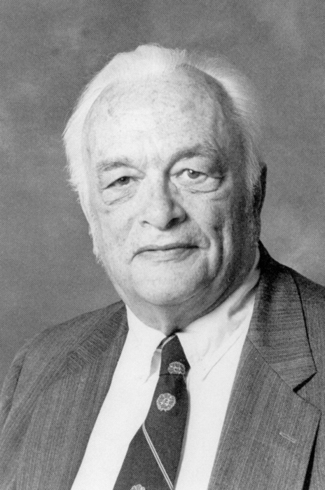

---
## Front matter
lang: ru-RU
title: Доклад
subtitle: Задача об эпидемии
author:
  - Камкина А. Л.
institute:
  - Российский университет дружбы народов, Москва, Россия

## i18n babel
babel-lang: russian
babel-otherlangs: english

## Formatting pdf
toc: false
toc-title: Содержание
slide_level: 2
aspectratio: 169
section-titles: true
theme: metropolis
header-includes:
 - \metroset{progressbar=frametitle,sectionpage=progressbar,numbering=fraction}
 - '\makeatletter'
 - '\beamer@ignorenonframefalse'
 - '\makeatother'
---

# Информация

## Докладчик

:::::::::::::: {.columns align=center}
::: {.column width="70%"}

  * Камкина Арина Леонидовна
  * Студентка группы НКНбд-01-21
  * Российский университет дружбы народов
  * <https://alkamkina.github.io/ru/>

:::
::: {.column width="25%"}

:::
::::::::::::::

## Цель работы
Выяснить что такое закрытый аукцион и какие стратегии оптимальнее всего использовать в их участии.

---
## Закрытый аукцион
Это статический аукцион, в котором участники $однократно$ подают свои заявки. Здесь заявки подаются в $закрытом$ $порядке$ и участники торгов $не$ $могут$ видеть цену, предлагаемую другими покупателями; зачастую объявляется только победившая цена.

---
## Разновидности 
В закрытых аукционах действуют два правила определения цены, которую выплачивает участник торгов, предложивший наивысшую цену:

В случае закрытого аукциона $первой$ $цены$ выставленный на продажу объект достается участнику торгов, предложившему самую высокую цену, и он выплачивает цену, указанную в заявке. Обычно закрытые аукционы являются аукционами первой цены.

В случае закрытого аукциона $второй$ $цены$ выставленный на продажу объект получает участник торгов, предложивший самую высокую цену, но при этом он выплачивает цену, указанную в заявке участника торгов, предложившего вторую самую высокую цену. Сегодня широко не применяются.

---
## Закрытый аукционы первой цены
Представим, что интересующий вас лот продается на закрытом аукционе первой цены и вы подозреваете, что предложенная вами цена будет слишком $высокой$. Вам нужно решить, что предложить — вашу цену $N$ или что-то другое.
Здесь вы не должны предлагать цену $N$. Она обеспечила бы вам нулевую прибыль, поэтому вам выгоднее немного снизить сумму заявки. Выставив цену чуть меньше $N$, вы рискуете проиграть аукцион, если другой участник торгов предложит цену выше вашей, но ниже $N$. Но если ваша цена будет не настолько низкой, чтобы привести к такому исходу, существует $положительная$ $вероятность$ $получения$ $прибыли$.

Поэтому в аукционе первой цены люди будут стараться занижать цену, они не будут говорить честную сумму, они все время будут указывать нечто меньшее.
Это и есть $оптимальная$ $стратегия$ $-$ $намеренное$ $снижение$ $цены$ $предложения$.

---
## Закрытый аукционы второй цены - аукцион Викри
Лауреат Нобелевской премии по экономике $Уильям$ $Викри$ доказал, что участники торгов будут раскрывать истинную оценку выставленного на продажу объекта с личной ценностью, если его продавец использует модифицированную версию стандартной схемы проведения закрытых аукционов первой цены.
В аукционе второй цены оптимальная стратегия для каждого участника аукциона — предложение правдивой цены. 
Попробуем доказать это. 

Представим, что моя ценность лота — $800$ $. Что я могу сделать? Я могу указать либо $800$ $, либо сумму меньше, либо сумму больше. Рассмотрим два последних случая.

---
## Аукцион Викри - стратегия завышения цены
Если я указываю $900 $ $. Посмотрим на сумму второго. Если она больше $900$ $, то мне всё равно, потому что я и так, и так проигрываю аукцион. Если остальные указали сумму меньше $800 $ $,в любом случае этот аукцион я выигрываю.

Отличие возникает ровно в одной ситуации: когда кто-то указал сумму между $800$ $ и $900$ $, например, $850$ $. Кто выигрывает этот аукцион? Выигрываю я, потому что я указал $900$ $ в надежде на победу, и даже этой победы добился, моя цель исполнилась. Но я должен заплатить цену второго, а цена второго — $850$ $ — больше, чем моя ценность. Я в этой ситуации проигрываю. Я должен был проиграть именно аукцион, уйти ни с чем, а я в итоге выигрываю аукцион, но это победа Пиррова, потому что я заплатил больше, чем ценность лота для меня.

---
## Аукцион Викри - стратегия занижения цены
Если я указываю $700 $ $.Если участник под номером два указал сумму меньше, чем $700 $ $, я выигрываю аукцион. Если второй участник указал сумму больше, чем $800 $ $ я проигрываю аукцион. 

Если второй участник указал $750 $ $, сумму между моей ставкой и моей ценностью,  тогда начинаются проблемы. Потому что я должен был указать $800 $ $ и выиграть аукцион, заплатив за лот $750 $ $ и получив некоторую выгоду. А в итоге я указал $700 $ $ и проигрываю аукцион, выигрывает другой участник, я остаюсь ни с чем в той ситуации, когда должен был уйти с плюсом.

---
## Аукцион Викри

:::::::::::::: {.columns align=center}
::: {.column width="70%"}

Итог такой, мне не стоит так поступать: ни завышать цену, ни занижать цену. Самый лучший результат оказывается ровно тогда, когда я указываю честно свою ценность лота. В этом и заключается достижение Уильяма Викри.

:::
::: {.column width="25%"}

:::
::::::::::::::

---
# Вывод
Мы познакомились с разновидностями закрытых аукционов и выявили наиболее оптимальные стратегии для участия в них.