---
## Front matter
title: "Лабораторная работа №1"
subtitle: "Работа с git"
author: "Камкина Арина Леонидовна"

## Generic otions
lang: ru-RU
toc-title: "Содержание"

## Bibliography
bibliography: bib/cite.bib
csl: pandoc/csl/gost-r-7-0-5-2008-numeric.csl

## Pdf output format
toc: true # Table of contents
toc-depth: 2
lof: true # List of figures
lot: true # List of tables
fontsize: 12pt
linestretch: 1.5
papersize: a4
documentclass: scrreprt
## I18n polyglossia
polyglossia-lang:
  name: russian
  options:
	- spelling=modern
	- babelshorthands=true
polyglossia-otherlangs:
  name: english
## I18n babel
babel-lang: russian
babel-otherlangs: english
## Fonts
mainfont: PT Serif
romanfont: PT Serif
sansfont: PT Sans
monofont: PT Mono
mainfontoptions: Ligatures=TeX
romanfontoptions: Ligatures=TeX
sansfontoptions: Ligatures=TeX,Scale=MatchLowercase
monofontoptions: Scale=MatchLowercase,Scale=0.9
## Biblatex
biblatex: true
biblio-style: "gost-numeric"
biblatexoptions:
  - parentracker=true
  - backend=biber
  - hyperref=auto
  - language=auto
  - autolang=other*
  - citestyle=gost-numeric
## Pandoc-crossref LaTeX customization
figureTitle: "Рис."
tableTitle: "Таблица"
listingTitle: "Листинг"
lofTitle: "Список иллюстраций"
lotTitle: "Список таблиц"
lolTitle: "Листинги"
## Misc options
indent: true
header-includes:
  - \usepackage{indentfirst}
  - \usepackage{float} # keep figures where there are in the text
  - \floatplacement{figure}{H} # keep figures where there are in the text
---

# Цель работы

Приобретение практических навыков работы с системой контроля версий git.

---

# Задание

1. Подготовка
    1. Настройте core.autocrlf с параметрами true и input
    2. Установите отображения unicode
2. Создание проекта
    1. Создайте страницу «Hello, World»
    2. Создайте репозиторий
    3. Добавьте файл в репозиторий
    4. Проверьте состояние репозитория
3. Внесение изменений
    1. Измените страницу «Hello, World»
4. Индексация изменений
    1. Сделайте коммит и проверить состояние
    2. Добавьте стандартные теги страницы
    3. Получите список произведённых изменений
    4. Получите старые версии
    5. Создайте теги версий
    6. Переключитесь по имени тега
    7. Просмотрите теги с помощью команды tag
5.  Отмена локальных изменений (до индексации)
    1. Переключитесь на ветку master
    2. Измените hello.html
    3. Проверьте состояние
    4. Отмените изменения в рабочем каталоге
6. Отмена проиндексированных изменений (перед коммитом)
    1. Измените файл и проиндексировать изменения
    2. Проверьте состояние
    3. Выполните сброс буферной зоны
    4. Переключитесь на версию коммита
7. Отмена коммитов
    1. Измените файл и сделайте коммит
    2. Сделайте коммит с новыми изменениями, отменяющими предыдущие
    3. Проверьте лог
8. Удаление коммиттов из ветки
    1. Проверьте нашу историю
    2. Отметьте эту ветку
    3. Сбросьте коммиты к предшествующим коммиту Oops
9. Удаление тега oops
10. Внесение изменений в коммиты
    1. Измените страницу, а затем сделайте коммит
    2. Измените предыдущий коммит
11. Перемещение файлов
    1. Переместите файл hello.html в каталог lib
12. Подробнее о структуре
    1. Добавьте index.html
13. Git внутри: Каталог .git
    1. Выполните:
    > ls -C .git

    > ls -C .git/objects

    > ls -C .git/objects/<dir>

    > cat .git/config

    > ls .git/refs

    > ls .git/refs/heads

    > ls .git/refs/tags

    > cat .git/refs/tags/v1

    > cat .git/HEAD
14. Работа непосредственно с объектами git
    1. Выведите последний коммит с помощью SHA1 хэша
    2. Выведите каталога lib
    3. Выведите файла hello.html
15. Создание ветки
    1. Создайте ветку
    2. Добавьте файл стилей style.css
    3. Измените основную страницу
    4. Измените index.html
16. Навигация по веткам
    1. Переключитесь на ветку master
    2. Вернитесь к ветке style
17. Изменения в ветке master
    1. Создайте файл README в ветке master
18. Сделайте коммит изменений README.md в ветку master
    1. Просмотрите текущие ветки
19. Слияние
20. Создание конфликта
    1. Вернитесь в master и создайте конфликт
21. Разрешение конфликтов
    1. Сделайте коммит решения конфликта
22. Сброс ветки style
    1. Сбросьте ветку style
    2. Проверьте ветку
23. Сброс ветки master
    1. Сбросьте ветку master
24. Перебазирование
25. Слияние в ветку master
    1. Выполните слияние style в master
26.  Клонирование репозиториев
    1. Перейдите в рабочий каталог
    2. Создайте клон репозитория hello
27. Просмотр клонированного репозитория
    1. Взгляните на клонированный репозиторий
28. Что такое origin?
    1. Выполните:
    > git remote

    > git remote show origin
29. Удаленные ветки
    Выполните:
    > git branch
30. Изменение оригинального репозитория
    1. Внесите изменения в оригинальный репозиторий hello
    2. Извлеките изменения
    3. Проверьте README.md
31. Слияние извлеченных изменений
    1. Слейте извлеченные изменения в локальную ветку master
    2. Еще раз проверьте файл README.md
32. Добавление ветки наблюдения
    1. Добавьте локальную ветку, которая отслеживает удаленную ветку
33. Создание чистого репозитория
34. Добавление удаленного репозитория
35. Отправка изменений
36. Извлечение общих изменений

---

# Выполнение лабораторной работы

0. Зашла в систему, используя своё имя пользлвателя.

1. 
    1. Настроила core.autocrlf с параметрами true и input(рис. [-@fig:001])

    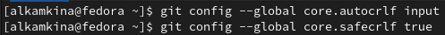
    { #fig:001 width=70% }
    2. Установила отображения unicode(рис. [-@fig:002])

    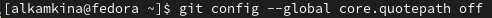
    { #fig:002 width=70% }
2. 
    1. Создала страницу «Hello, World»
    (роис. [-@fig:003])

    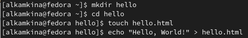
    { #fig:003 width=70% }

    2. Создала репозиторий и добавила файл hello.html в репозиторий и проверила состояние(рис. [-@fig:004])

    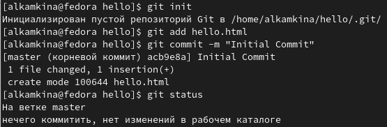
    { #fig:004 width=70% }
3. 1. Изменила страницу «Hello, World» и проверила состяние
    (рис. [-@fig:005])

    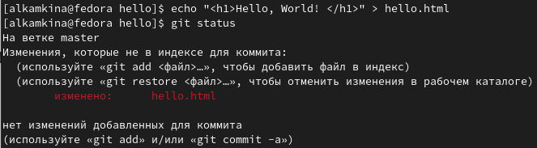
    { #fig:005 width=70% }

4. 
    1. Проиндексировала изменения и проверила состояние (рис. [-@fig:006])

    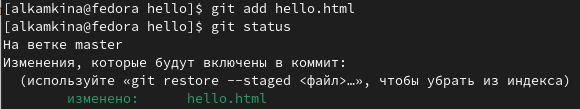
    { #fig:006 width=70% }
    2. Сделала коммит и провериал состояние (рис. [-@fig:007])

    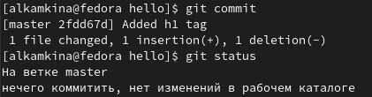
    { #fig:007 width=70% }
    3. Изменила несколько раз файл провериал состояние (рис. [-@fig:008])

    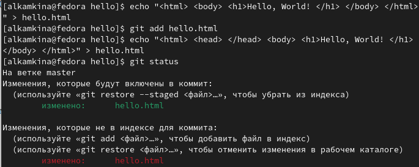
    { #fig:008 width=70% }
    4. Коммит проиндексированного изменения и проверила состояние (рис. [-@fig:009])

    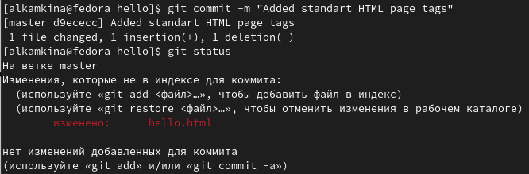
    { #fig:009 width=70% }
    5. Добавила второе состояния в индекс и коммит (рис. [-@fig:010])

    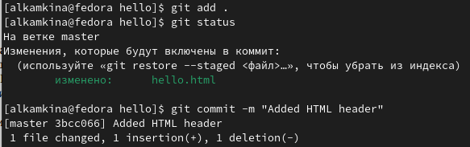
    { #fig:010 width=70% }
    6. Получила список изменений (рис. [-@fig:011])

    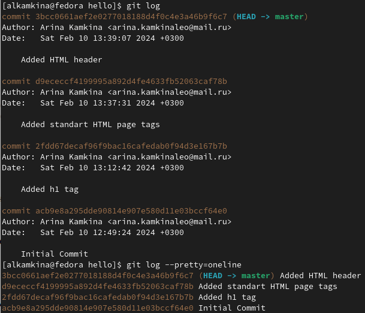
    { #fig:011 width=70% }
    7. Получила старые версии (рис. [-@fig:012])

    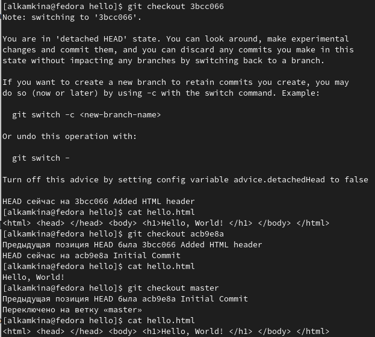
    { #fig:012 width=70% }
    8. Создала теги для нескольких версий и попереключалась между ними (рис. [-@fig:013])

    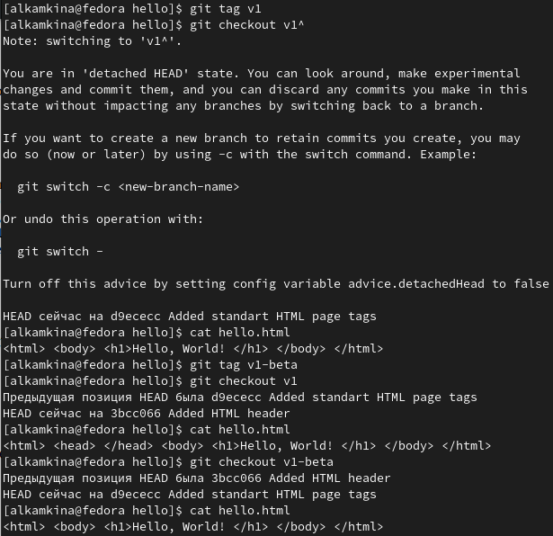
    { #fig:013 width=70% }
    9. Посмотрела теги в логе (рис. [-@fig:014])

    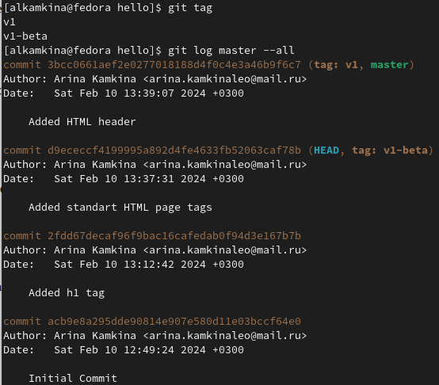
    { #fig:014 width=70% }
5. 
    1. Работала над отменой локальных изменений (рис. [-@fig:015])

    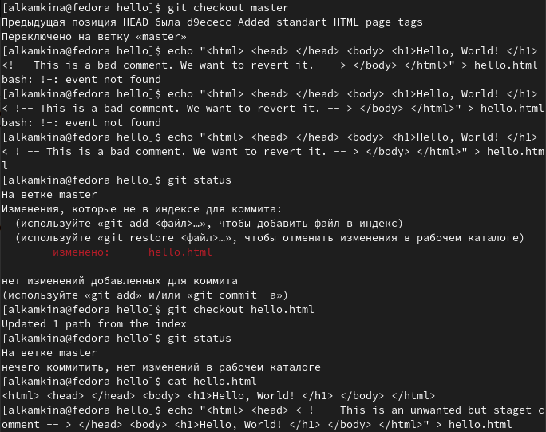
    { #fig:015 width=70% }
6. 
    1. Работала над отменой проиндексированных изменений (рис. [-@fig:016])

    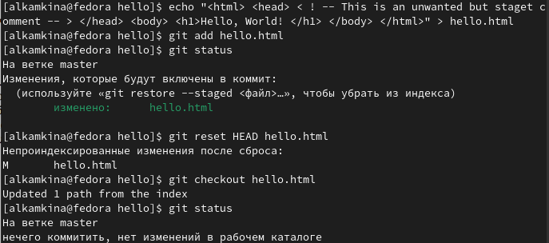
    { #fig:016 width=70% }
7. 
    1. Работала над отменой коммитов (рис. [-@fig:017], [-@fig:018])

    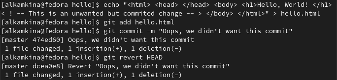
    { #fig:017 width=70% }

    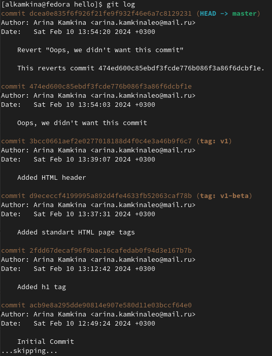
    { #fig:018 width=70% }
8. 
    1. Работала с тегом oops (рис. [-@fig:019], [-@fig:020])

    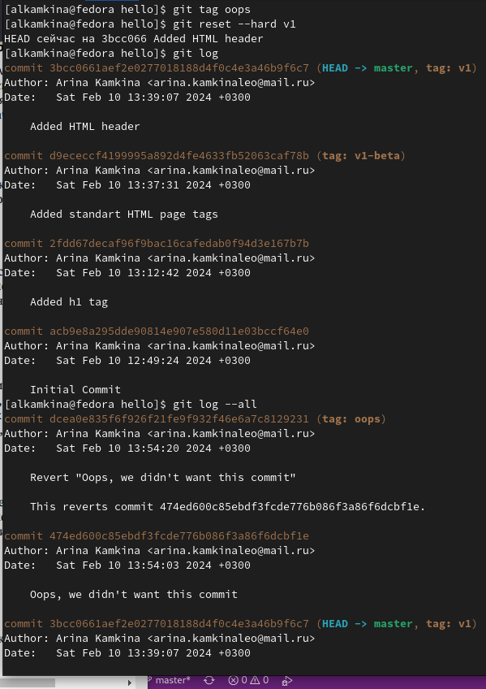
    { #fig:019 width=70% }

    ![Удаление oops]](image/20.png)
    { #fig:020 width=70% }
10. 
    1. Добавила фио и почту (рис. [-@fig:021], [-@fig:022])

    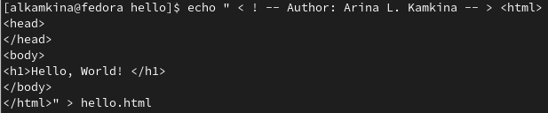
    { #fig:021 width=70% }
    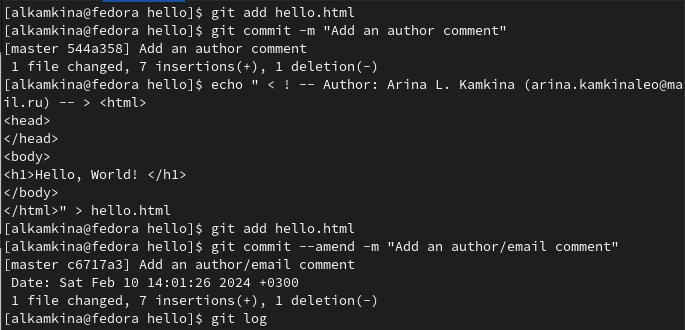
    { #fig:021 width=70% }
11. 
    1. Переместила файл (рис. [-@fig:023])

    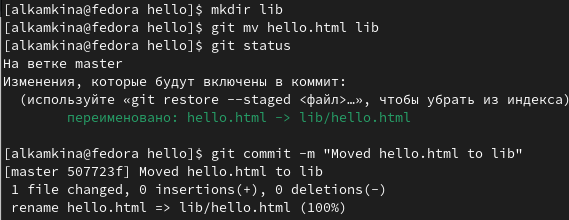
    { #fig:023 width=70% }
12. 
    1. Поиграла со структурой (рис. [-@fig:024])

    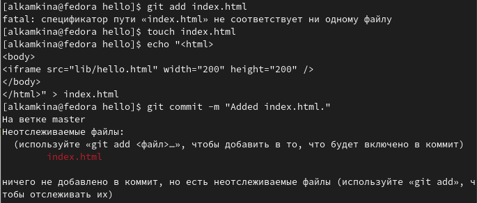
    { #fig:024 width=70% }
13. 
    1. Углубилась в git (рис. [-@fig:025])

    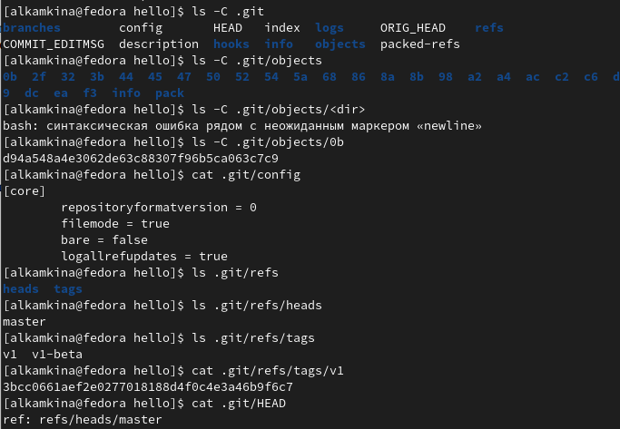
    { #fig:025 width=70% }
14. 
    1. Поработала с объектами git (рис. [-@fig:026])

    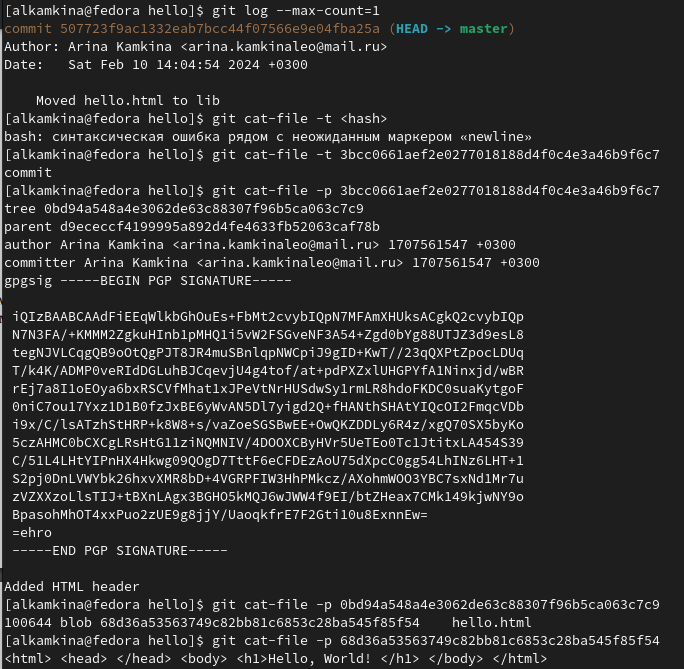
    { #fig:026 width=70% }
15. 
    1. Создала ветки (рис. [-@fig:027], [-@fig:028])

    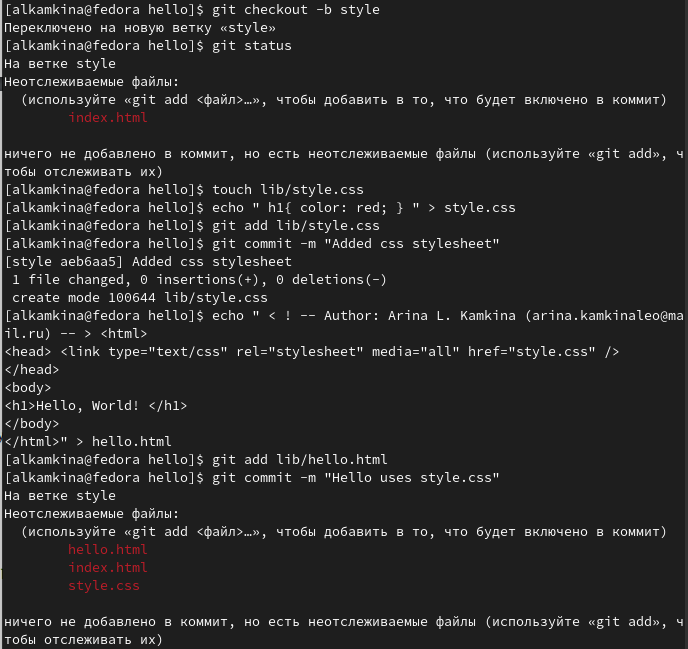
    { #fig:027 width=70% } 
    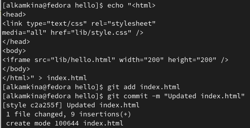
    { #fig:028 width=70% } 
16. 
    1. Переключалась на ветки (рис. [-@fig:029])

    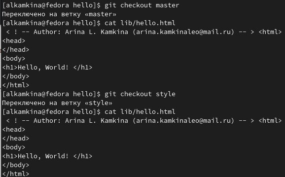
    { #fig:029 width=70% }
16. 
    1. Сделала коммит изменений README.md в ветку master. (рис. [-@fig:030])

    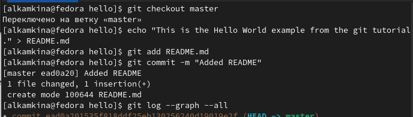
    { #fig:030 width=70% }
17. 
    1. Слияние веток и создание конфликта (рис. [-@fig:031], [-@fig:032])

    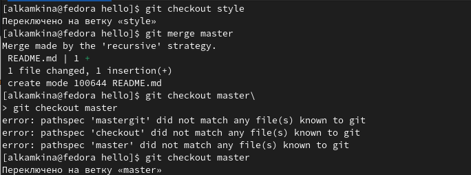
    { #fig:031 width=70% } 
    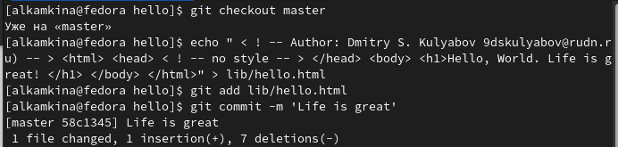
    { #fig:032 width=70% } 
18. 
    1. Перебазирование (рис. [-@fig:033])

    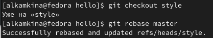
    { #fig:033 width=70% }
19. 
    1. Слияние (рис. [-@fig:034])

    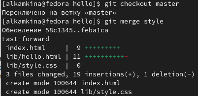
    { #fig:034 width=70% }
20. 
    1. Клонирование репозиториев и origin (рис. [-@fig:035])

    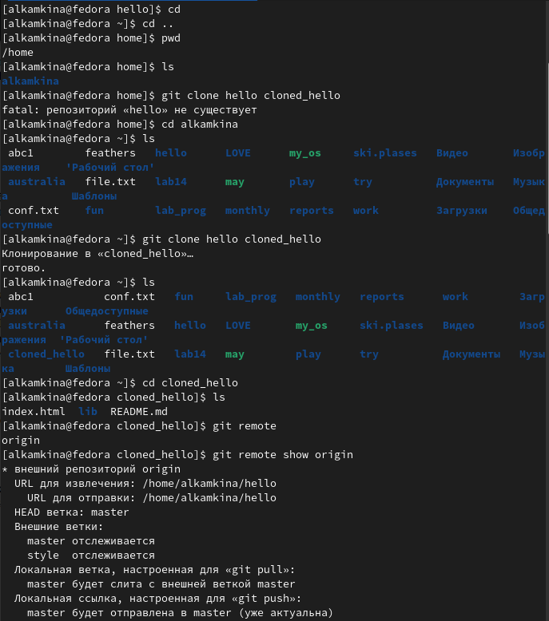
    { #fig:035 width=70% }
21. 
    1. Просмотрела удалённые ветки (рис. [-@fig:036])

    ![Удаленные ветки(image/36.png)
    { #fig:036 width=70% }
22. 
    1. Выполнила слияние и извлечение изменений рис. [-@fig:037], [-@fig:038])

    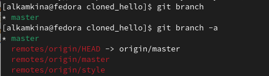
    { #fig:037 width=70% } 
    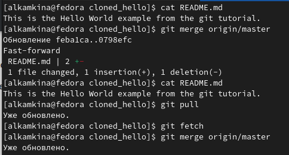
    { #fig:038 width=70% } 
23. 
    1. Создание чистого репозитория и отпраква изменений (рис. [-@fig:039])

    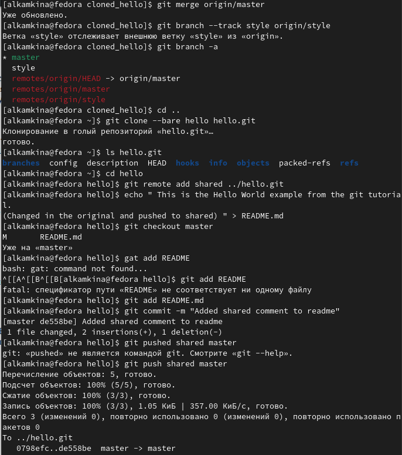
    { #fig:039 width=70% }
24. Извлекла общие изменения (рис. [-@fig:040])

    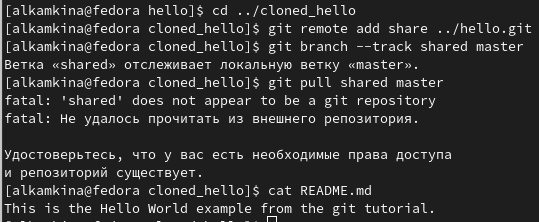
    { #fig:040 width=70% }
---

# Вывод

Получила практические и теоретичексие навыки работы с git.

---

