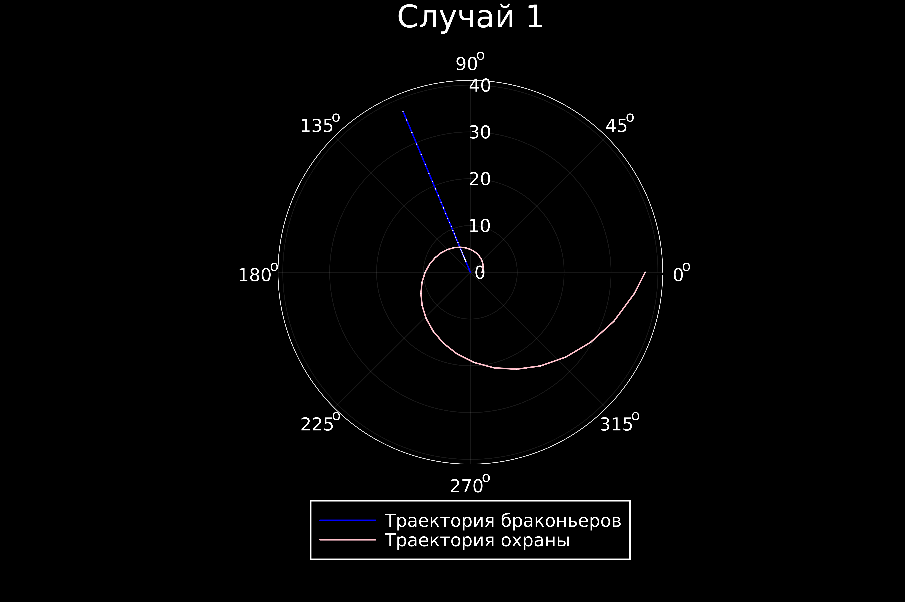
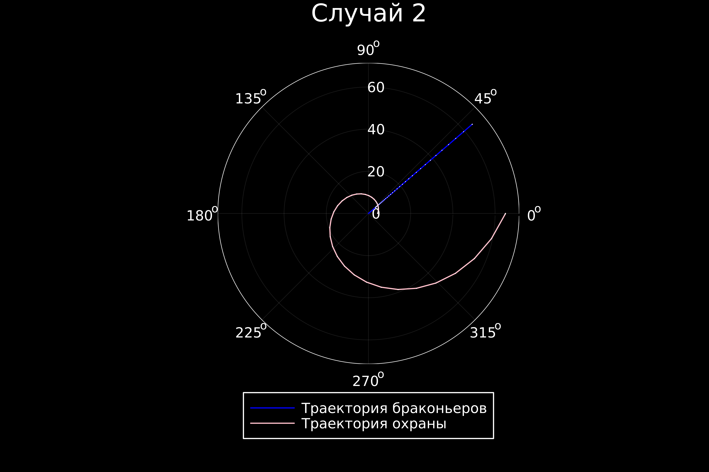

---
## Front matter
lang: ru-RU
title: Лабораторная работа №2
subtitle: Задача о погоне
author:
  - Камкина А. Л.
institute:
  - Российский университет дружбы народов, Москва, Россия

## i18n babel
babel-lang: russian
babel-otherlangs: english

## Formatting pdf
toc: false
toc-title: Содержание
slide_level: 2
aspectratio: 169
section-titles: true
theme: metropolis
header-includes:
 - \metroset{progressbar=frametitle,sectionpage=progressbar,numbering=fraction}
 - '\makeatletter'
 - '\beamer@ignorenonframefalse'
 - '\makeatother'
---

# Информация

## Докладчик

:::::::::::::: {.columns align=center}
::: {.column width="70%"}

  * Камкина Арина Леонидовна
  * студентка
  * Российский университет дружбы народов
  * [1032216456@pfur.ru](mailto:1032216456@pfur.ru)
  * <https://alkamkina.github.io/ru/>

:::
::: {.column width="25%"}


:::
::::::::::::::


## Цель работы

Приобрести практические навыки работы с языком Julia и OpenModelica, научиться строить графики и решать математические задачи.

## Вводная часть Julia

Julia — высокоуровневый свободный язык программирования с динамической типизацией, созданный для математических вычислений. Эффективен также и для написания программ общего назначения. Синтаксис языка схож с синтаксисом других математических языков (например, MATLAB и Octave), однако имеет некоторые существенные отличия. Julia написан на Си, C++ и Scheme. Имеет встроенную поддержку многопоточности и распределённых вычислений, реализованные в том числе в стандартных конструкциях.

## Вводная часть OpenModelica

OpenModelica — свободное открытое программное обеспечение для моделирования, симуляции, оптимизации и анализа сложных динамических систем. Основано на языке Modelica. Активно развивается Open Source Modelica Consortium, некоммерческой неправительственной организацией. Open Source Modelica Consortium является совместным проектом RISE SICS East AB и Линчёпингского университета. По своим возможностям приближается к таким вычислительным средам как Matlab Simulink, Scilab xCos, имея при этом значительно более удобное представление системы уравнений исследуемого блока.

## Задание

На море в тумане катер береговой охраны преследует лодку браконьеров.
Через определенный промежуток времени туман рассеивается, и лодка
обнаруживается на расстоянии 11,7 км от катера. Затем лодка снова скрывается в
тумане и уходит прямолинейно в неизвестном направлении. Известно, что скорость
катера в 3,7 раза больше скорости браконьерской лодки.
1. Запишите уравнение, описывающее движение катера, с начальными
условиями для двух случаев (в зависимости от расположения катера
относительно лодки в начальный момент времени).
2. Постройте траекторию движения катера и лодки для двух случаев.
3. Найдите точку пересечения траектории катера и лодки 

# Выполнение лабораторной работы

## Подготовка

1. Установила язык Julia
2. Произвела математические вычисления:
    1. Введем полярные координаты.
    2. Траектория катера должна быть такой, чтобы и катер, и лодка все время были на одном расстоянии от полюса, только в этом случае траектория катера пересечется с траекторией лодки. 
    3.  Пусть через время t катер и лодка окажутся на одном расстоянии x от полюса. За это время лодка пройдет x, а катер k-x (или k+x, в зависимости от начального положения катера относительно полюса).
    Отсюда у нас выходит два случая:
    > r0_1 = 11.7/(3.7+1) и r0_2 = 11.7/(3.7-1)
    4. После того, как катер береговой охраны окажется на одном расстоянии от полюса, что и лодка, он должен сменить прямолинейную траекторию и начать двигаться вокруг полюса удаляясь от него со скоростью лодки v.
    2.5. Решение исходной задачи сводится к решению системы из двух дифференциальных уравнений, из которой выходит, что 
    > r=/exp(1.0)^(teta/sqrt(12.69))

## Создание проекта (код на Julia)
```
using Plots
using DifferentialEquations

n = parse(Float64, "3.7")
s = parse(Float64, "11.7")

r0_1 = s/(n+1)
r0_2 = s/(n-1)

tspan = (0, 2*pi)

function f(u, p, t)
    u/exp(1.0)^(teta/sqrt(12.69))
end
prob = ODEProblem(f, r0_1, tspan)
sol = solve(prob, Tsit5(), reltol = 1e-8, abstol = 1e-8)
dxR = rand(1:size(sol.t)[1])
rAngles = [sol.t[dxR] for i in 1:size(sol.t)[1]]

plt1 = plot(proj=:polar, aspect_ratio=:equal, dpi = 1000, legend=true, bg=:black)

plot!(plt1, xlabel="", ylabel="", title="Случай 1", legend=:outerbottom)
plot!(plt1, [rAngles[1], rAngles[2]], [0.0, sol.u[size(sol.u)[1]]], label="Траектория браконьеров", color=:blue, lw=1)
scatter!(plt1, rAngles, sol.u, label="", mc=:blue, ms=0.0005)
plot!(plt1, sol.t, sol.u, xlabel="", ylabel="", label="Траектория охраны", color=:pink, lw=1)
scatter!(plt1, sol.t, sol.u, label="", mc=:pink, ms=0.0005)

savefig(plt1, "try1.png")

prob = ODEProblem(f, r0_2, tspan)
sol = solve(prob, Tsit5(), reltol = 1e-8, abstol = 1e-8)
dxR = rand(1:size(sol.t)[1])
rAngles = [sol.t[dxR] for i in 1:size(sol.t)[1]]

plt1 = plot(proj=:polar, aspect_ratio=:equal, dpi = 1000, legend=true, bg=:black)

plot!(plt1, xlabel="", ylabel="", title="Случай 2", legend=:outerbottom)
plot!(plt1, [rAngles[1], rAngles[2]], [0.0, sol.u[size(sol.u)[1]]], label="Траектория браконьеров", color=:blue, lw=1)
scatter!(plt1, rAngles, sol.u, label="", mc=:blue, ms=0.0005)
plot!(plt1, sol.t, sol.u, xlabel="", ylabel="", label="Траектория охраны", color=:pink, lw=1)
scatter!(plt1, sol.t, sol.u, label="", mc=:pink, ms=0.0005)

savefig(plt1, "try2.png")
```
## Результат работы кода

Получила следующие графики:
Полученные графики(рис. @fig:001, @fig:002).

{#fig:001 width=70%}
{#fig:001 width=70%}

# Вывод
В процессе выполнения данной лабораторной работы я приобрела практические навыки работы с языком Julia.