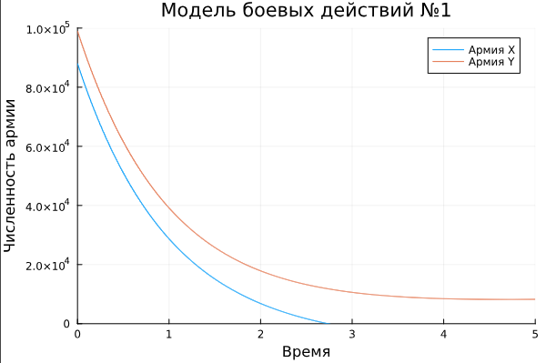
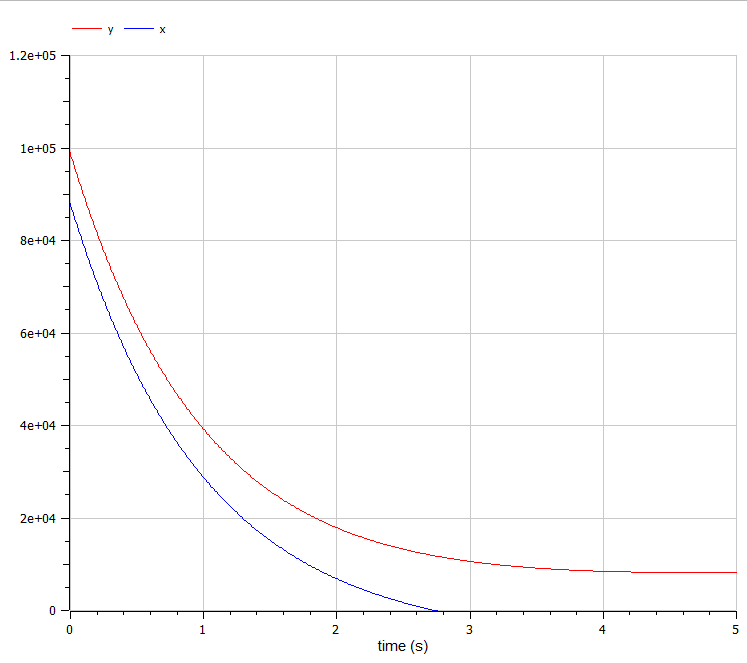
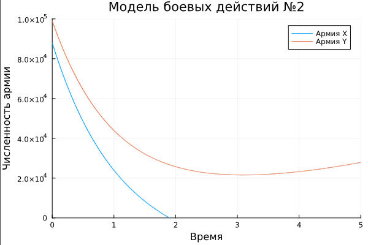
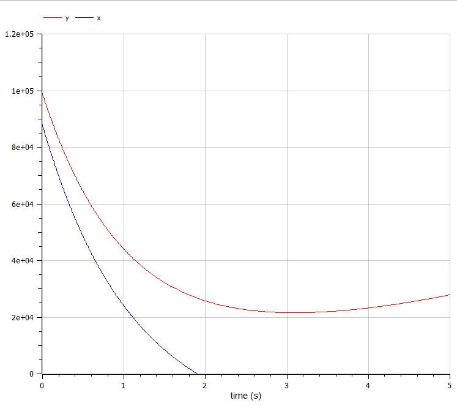

---
## Front matter
lang: ru-RU
title: Лабораторная работа №2
subtitle: Задача о погоне
author:
  - Камкина А. Л.
institute:
  - Российский университет дружбы народов, Москва, Россия

## i18n babel
babel-lang: russian
babel-otherlangs: english

## Formatting pdf
toc: false
toc-title: Содержание
slide_level: 2
aspectratio: 169
section-titles: true
theme: metropolis
header-includes:
 - \metroset{progressbar=frametitle,sectionpage=progressbar,numbering=fraction}
 - '\makeatletter'
 - '\beamer@ignorenonframefalse'
 - '\makeatother'
---

# Информация

## Докладчик

:::::::::::::: {.columns align=center}
::: {.column width="70%"}

  * Камкина Арина Леонидовна
  * студентка
  * Российский университет дружбы народов
  * [1032216456@pfur.ru](mailto:1032216456@pfur.ru)
  * <https://alkamkina.github.io/ru/>

:::
::: {.column width="25%"}


:::
::::::::::::::


## Цель работы

Рассмотреть некоторые простейшие модели боевых действий – модели Ланчестера и построить графики зависимости численности армии от времени, используя языки Julia и OpenModelica.

## Законы Ланчестера

Законы Ланчестера (законы Осипова — Ланчестера) — математическая формула для расчета относительных сил пары сражающихся сторон — подразделений вооруженных сил. В статье «Влияние численности сражающихся сторон на их потери», опубликованной журналом «Военный сборник» в 1915 году, генерал-майор Корпуса военных топографов М. П. Осипов описал математическую модель глобального вооружённого противостояния, практически применяемую в военном деле при описании убыли сражающихся сторон с течением времени и, входящую в математическую теорию исследования операций, на год опередив английского математика Ф. У. Ланчестера. Мировая война, две революции в России не позволили новой власти заявить в установленном в научной среде порядке об открытии царского офицера.

## Задание

Так как задание выполняется по вариантам, сначала нужно рассчитать свой - мой вариант 27.
Между страной $X$ и страной $Y$ идет война. Численность состава войск исчисляется от начала войны, и являются временными функциями $x(t)$ и $y(t)$. В начальный момент времени страна $X$ имеет армию численностью 88 000 человек, а в распоряжении страны $Y$ армия численностью в 99 000 человек. Для упрощения модели считаем, что коэффициенты $a$, $b$, $c$, $h$ постоянны. Также считаем $P(t)$ и $Q(t)$ непрерывные функции.

Построить графики изменения численности войск армии $X$ и армии $Y$ для следующих случаев:

1. Модель боевых действий между регулярными войсками
2. Модель ведение боевых действий с участием регулярных войск и партизанских отрядов 

# Выполнение лабораторной работы

## Модель боевых действий между регулярными войсками

Зададим коэффициент смертности, не связанный с боевыми действиями у первой армии 0,45, у второй 0,55. Коэффициенты эффективности первой и второй армии 0,58 и 0,45 соответственно. Функция, описывающая подход подкрепление первой армии, $P(t) = \sin{t+15}$, подкрепление второй армии описывается функцией $Q(t) = \cos{t+3}$. Тогда получим следующую систему, описывающую противостояние между регулярными войсками X и Y:

$$
\begin{cases}
\dfrac{dx}{dt} = -0,45 x(t)- 0,55 y(t) + \sin{t+15}\\
\dfrac{dy}{dt} = -0,58 x(t)- 0,45 y(t) + \cos{t+3}
\end{cases}
$$

Наши начальные условия:

$$
\begin{cases}
X = 88000 \\
Y = 99000
\end{cases}
$$
## Модель боевых действий между регулярными войсками
### Создание проекта (код на Julia)
```
using Plots
using DifferentialEquations

X = 88000
Y = 99000
R = [0.45, 0.55, 0.58, 0.45]

tspan = (0, 5)

function f(u, p, t)
   x, y = u 
   a, b, c, h = p
   dx  = -a*x - b*y + sin(t+15)
   dy  = -c*x - h*y + cos(t+3)
   return [dx, dy]
end

prob = ODEProblem(f, [X, Y], tspan, R)
sol = solve(prob, Tsit5())

#plt1 = plot(proj=:polar, aspect_ratio=:equal, dpi = 1000, legend=true, bg=:black)
plot(sol, title = "Модель боевых действий №1", 
label = ["Армия X" "Армия Y"], xaxis = "Время", yaxis = "Численность армии",
ylimit = [0, 100000])
```
## Модель боевых действий между регулярными войсками
Полученный график(рис. @fig:001).

{#fig:001 width=70%}
---
## Модель боевых действий между регулярными войсками
### Создание проекта (код на OpenModelica)
```
model l_3
Real x(start=88000);
Real y(start=99000);
Real p;
Real q;
parameter Real a=0.45;
parameter Real b=0.55;
parameter Real c=0.58;
parameter Real h=0.45;
equation
  der(x) = -a*x - b*y + p;
  der(y) = -c*x - h*y + q;
  p = sin(time + 15);
  q = cos(time + 3);
end l_3;
```
## Модель боевых действий между регулярными войсками
Полученный график(рис. @fig:002).

{#fig:002 width=70%}
---

## Модель ведение боевых действий с участием регулярных войск и партизанских отрядов

Зададим коэффициент смертности, не связанный с боевыми действиями у первой армии 0,38, у второй 0,67. Коэффициенты эффективности первой и второй армии 0,57 и 0,39 соответственно. Функция, описывающая подход подкрепление первой армии, $P(t) = \sin{7t}+1$, подкрепление второй армии описывается функцией $Q(t) = \cos{8t}+1$. Тогда получим следующую систему, описывающую противостояние между регулярными войсками X и Y:

$$
\begin{cases}
\dfrac{dx}{dt} = -0,38 x(t)- 0,67 y(t) + \sin{7t}+1\\
\dfrac{dy}{dt} = -0,57 x(t)- 0,39 y(t) + \cos{8t}+1
\end{cases}
$$

Наши начальные условия:

$$
\begin{cases}
X = 88000 \\
Y = 99000
\end{cases}
$$
## Модель ведение боевых действий с участием регулярных войск и партизанских отрядов
### Создание проекта (код на Julia)
```
using Plots
using DifferentialEquations

X = 88000
Y = 99000
R = [0.38, 0.67, 0.57, 0.39]

tspan = (0, 5)

function f(u, p, t)
   x, y = u 
   a, b, c, h = p
   dx  = -a*x - b*y + sin(7t) + 1
   dy  = -c*x - h*y + cos(8t) + 1
   return [dx, dy]
end

prob = ODEProblem(f, [X, Y], tspan, R)
sol = solve(prob, Tsit5())

#plt1 = plot(proj=:polar, aspect_ratio=:equal, dpi = 1000, legend=true, bg=:black)
plot(sol, title = "Модель боевых действий №2", 
label = ["Армия X" "Армия Y"], xaxis = "Время", yaxis = "Численность армии",
ylimit = [0, 100000])

```
## Модель ведение боевых действий с участием регулярных войск и партизанских отрядов
Полученный график(рис. @fig:003).

{#fig:003 width=70%}
---
## Модель ведение боевых действий с участием регулярных войск и партизанских отрядов
### Создание проекта (код на OpenModelica)
```
model l_3_2
Real x(start=88000);
Real y(start=99000);
Real p;
Real q;
parameter Real a=0.38;
parameter Real b=0.67;
parameter Real c=0.57;
parameter Real h=0.39;
equation
  der(x) = -a*x - b*y + p;
  der(y) = -c*x - h*y + q;
  p = sin(7*time)+1;
  q = cos(8*time)+1;
end l_3_2;

```
## Модель ведение боевых действий с участием регулярных войск и партизанских отрядов
Полученный график(рис. @fig:004).

{#fig:004 width=70%}

# Вывод
В процессе выполнения данной лабораторной работы я построила графики, используя Julia и OpenModelica, а также приобрела первые практические навыки работы с OpenModelica.