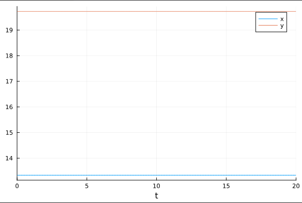
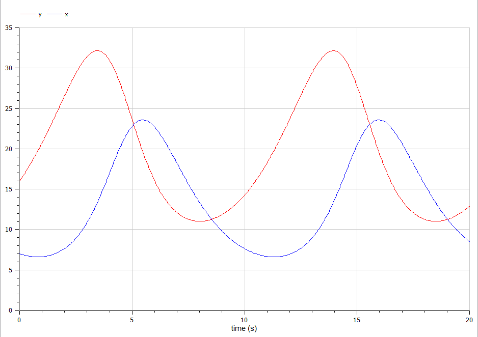
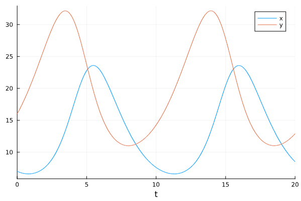
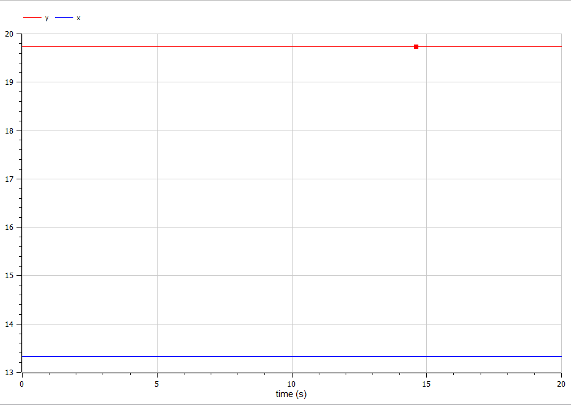

---
## Front matter
lang: ru-RU
title: Лабораторная работа №3
subtitle: Модель гармонических колебаний
author:
  - Камкина А. Л.
institute:
  - Российский университет дружбы народов, Москва, Россия

## i18n babel
babel-lang: russian
babel-otherlangs: english

## Formatting pdf
toc: false
toc-title: Содержание
slide_level: 2
aspectratio: 169
section-titles: true
theme: metropolis
header-includes:
 - \metroset{progressbar=frametitle,sectionpage=progressbar,numbering=fraction}
 - '\makeatletter'
 - '\beamer@ignorenonframefalse'
 - '\makeatother'
---

# Информация

## Докладчик

:::::::::::::: {.columns align=center}
::: {.column width="70%"}

  * Камкина Арина Леонидовна
  * студентка
  * Российский университет дружбы народов
  * [1032216456@pfur.ru](mailto:1032216456@pfur.ru)
  * <https://alkamkina.github.io/ru/>

:::
::: {.column width="25%"}


:::
::::::::::::::


## Цель работы

Исследовать математическую модель гармонического осциллятора и построить графики, используя языки Julia и OpenModelica.

## Гармони́ческие колеба́ния

Гармони́ческие колеба́ния — колебания, при которых физическая величина изменяется с течением времени по гармоническому (синусоидальному, косинусоидальному) закону.
Движение грузика на пружинке, маятника, заряда в электрическом контуре, а
также эволюция во времени многих систем в физике, химии, биологии и других
науках при определенных предположениях можно описать одним и тем же
дифференциальным уравнением, которое в теории колебаний выступает в качестве
основной модели. Эта модель называется линейным гармоническим осциллятором.

## Гармони́ческие колеба́ния

Уравнение свободных колебаний гармонического осциллятора имеет
следующий вид:
$$
\ddot x + 2\gamma\dot x + \omega _0^2x = 0
$$
где $x$ – переменная, описывающая состояние системы (смещение грузика, заряд
конденсатора и т.д.), $\gamma$ – параметр, характеризующий потери энергии (трение в
механической системе, сопротивление в контуре), $\omega$ – собственная частота колебаний, $t$ – время.

## Задание
Постройте фазовый портрет гармонического осциллятора и решение уравнения гармонического осциллятора для следующих случаев

1. Колебания гармонического осциллятора без затуханий и без действий внешней силы $\ddot x + 9x = 0$
2. Колебания гармонического осциллятора c затуханием и без действий внешней силы $\ddot x + 5.5\dot x + 4.4x = 0$
3. Колебания гармонического осциллятора c затуханием и под действием внешней силы $\ddot x + \dot x + 6x = 2*cos(0.5t)$

На интервале $t \in [0; 37]$ (шаг 0.5) с начальными условиями $X = -0.7, \, Y=0.7$ 

# Выполнение лабораторной работы

## Колебания гармонического осциллятора без затуханий и без действий внешней силы

### Создание проекта (код на Julia)
```
using Plots
using DifferentialEquations
X = -0.7
Y = 0.7
R1 = [0, 9]
tspan = (0, 37)

#без действия внешний силы
function f_1(dx, x, p, t)
	g, w = p
	dx[1] = x[2]
	dx[2] = -w^2*x[1] - g*x[2]
end

prob1 = ODEProblem(f_1, [X, Y], tspan, R1)
sol1 = solve(prob1, Tsit5(), saveat = 0.05)
plot(sol1, title = "График №1", label = ["X" "Y"])
```
Полученный график(рис. @fig:001).

{#fig:001 width=70%}
---
## Колебания гармонического осциллятора без затуханий и без действий внешней силы

### Создание проекта (код на OpenModelica)
```
model lab_04
Real x(start=-0.7);
Real y(start=0.7);
parameter Real w=9;
parameter Real g=0;
equation
  der(x)=y;
  der(y)=-w^2*x-g*y;
end lab_04;
```
Полученный график(рис. @fig:002).

{#fig:002 width=70%}

## Модель боевых действий между регулярными войсками
Полученный график(рис. @fig:001).

{#fig:001 width=70%}
---
## Колебания гармонического осциллятора c затуханием и без действий внешней силы

### Создание проекта (код на Julia)
```
using Plots
using DifferentialEquations
X = -0.7
Y = 0.7
R2 = [5.5, 4.4]
tspan = (0, 37)

#без действия внешний силы
function f_1(dx, x, p, t)
	g, w = p
	dx[1] = x[2]
	dx[2] = -w^2*x[1] - g*x[2]
end

prob2 = ODEProblem(f_1, [X, Y], tspan, R2)
sol2 = solve(prob2, Tsit5(), saveat = 0.05)
plot(sol2, title = "График №2", label = ["X" "Y"])

```
Полученный график(рис. @fig:003).

{#fig:003 width=70%}

## Kолебания гармонического осциллятора c затуханием и без действий внешней силы

### Создание проекта (код на OpenModelica)
```
model lab_04_2
Real x(start=-0.7);
Real y(start=0.7);
parameter Real w=4.4;
parameter Real g=5.5;
equation
  der(x)=y;
  der(y)=-w^2*x-g*y;
end lab_04_2;

```
Полученный график(рис. @fig:004).

{#fig:004 width=70%}
---
## Колебания гармонического осциллятора c затуханием и без действий внешней силы

## Колебания гармонического осциллятора c затуханием и под действием внешней силы

### Создание проекта (код на Julia)
```
using Plots
using DifferentialEquations
X = -0.7
Y = 0.7
R3 = [1, 6]
tspan = (0, 37)

#внешняя сила
f(t) = 2*cos(0.5*t)

#с действием в нешней силы
function f_3(dx, x, p, t)
	g, w = p
	dx[1] = x[2]
	dx[2] = -w^2*x[1] - g*x[2] + f(t)
end

prob3 = ODEProblem(f_3, [X, Y], tspan, R3)
sol3 = solve(prob3, Tsit5(), saveat = 0.05)
plot(sol3, title = "График №3", label = ["X" "Y"])

```
Полученный график(рис. @fig:005).

{#fig:003 width=70%}

## Колебания гармонического осциллятора c затуханием и под действием внешней силы

### Создание проекта (код на OpenModelica)
```
model lab_04_03
Real x(start=-0.7);
Real y(start=0.7);
Real f;
parameter Real w=6;
parameter Real g=1;
equation
  der(x)=y;
  der(y)=-w^2*x-g*y+f;
  f=2*cos(0.5*time);
end lab_04_03;

```
Полученный график(рис. @fig:006).

{#fig:004 width=70%}
---

# Вывод
В процессе выполнения данной лабораторной работы я построила графики, используя Julia и OpenModelica, а также приобрела первые практические навыки работы с Julia и OpenModelica.