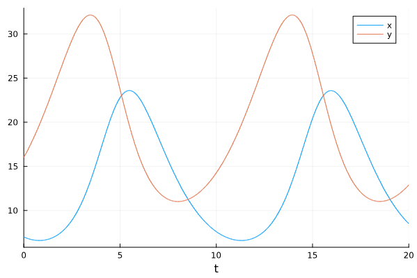
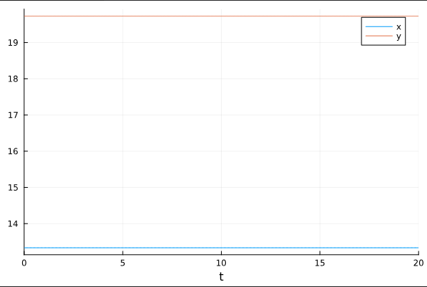
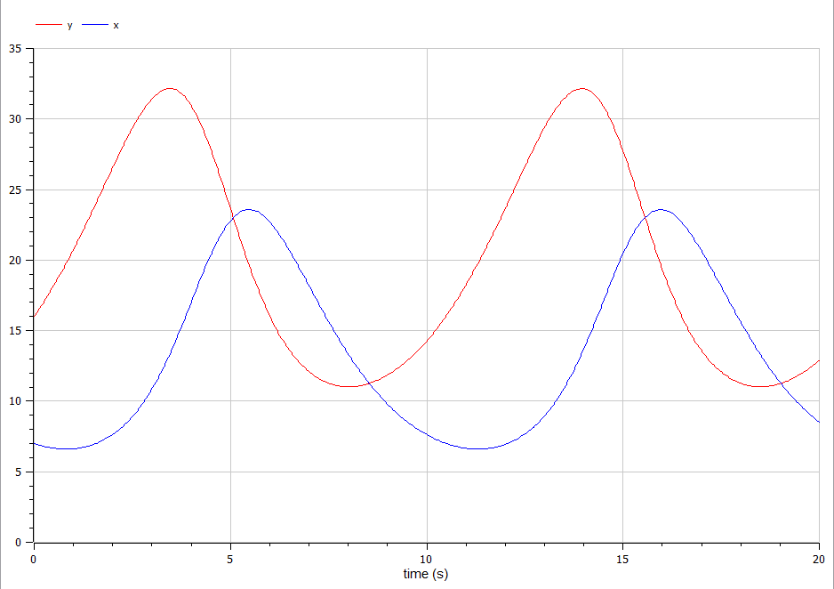
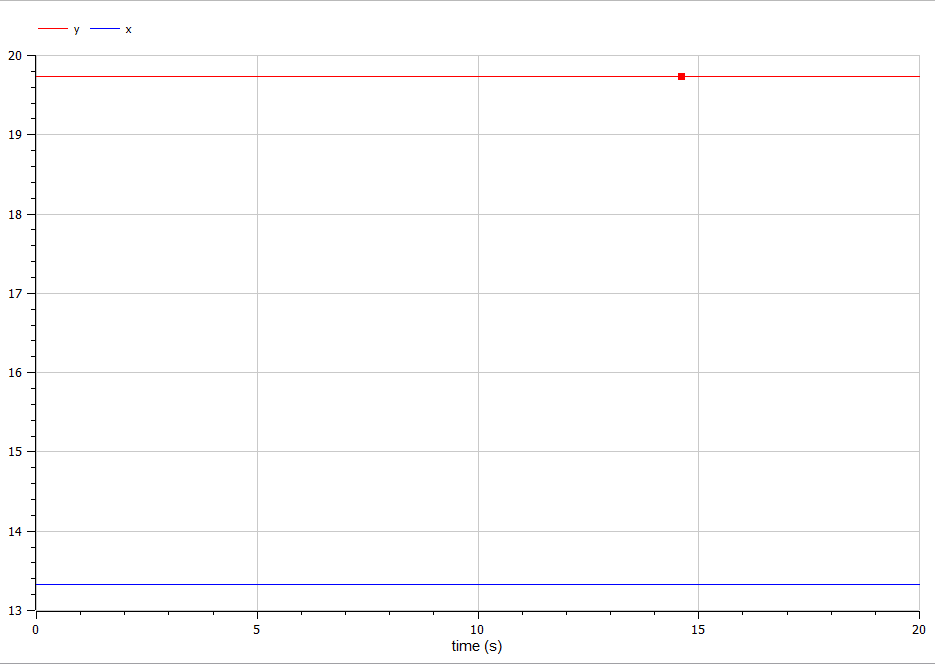

---
## Front matter
title: "Лабораторная работа №5"
subtitle: "Модель хищник-жертва"
author: "Камкина Арина Леонидовна"

## Generic otions
lang: ru-RU
toc-title: "Содержание"

## Bibliography
bibliography: bib/cite.bib
csl: pandoc/csl/gost-r-7-0-5-2008-numeric.csl

## Pdf output format
toc: true # Table of contents
toc-depth: 2
lof: true # List of figures
lot: false # List of tables
fontsize: 12pt
linestretch: 1.5
papersize: a4
documentclass: scrreprt
## I18n polyglossia
polyglossia-lang:
  name: russian
  options:
	- spelling=modern
	- babelshorthands=true
polyglossia-otherlangs:
  name: english
## I18n babel
babel-lang: russian
babel-otherlangs: english
## Fonts
mainfont: PT Serif
romanfont: PT Serif
sansfont: PT Sans
monofont: PT Mono
mainfontoptions: Ligatures=TeX
romanfontoptions: Ligatures=TeX
sansfontoptions: Ligatures=TeX,Scale=MatchLowercase
monofontoptions: Scale=MatchLowercase,Scale=0.9
## Biblatex
biblatex: true
biblio-style: "gost-numeric"
biblatexoptions:
  - parentracker=true
  - backend=biber
  - hyperref=auto
  - language=auto
  - autolang=other*
  - citestyle=gost-numeric
## Pandoc-crossref LaTeX customization
figureTitle: "Рис."
tableTitle: "Таблица"
listingTitle: "Листинг"
lofTitle: "Список иллюстраций"
lotTitle: "Список таблиц"
lolTitle: "Листинги"
## Misc options
indent: true
header-includes:
  - \usepackage{indentfirst}
  - \usepackage{float} # keep figures where there are in the text
  - \floatplacement{figure}{H} # keep figures where there are in the text
---

# Цель работы
Исследовать модель взаимодействия двух видов типа «хищник — жертва» -
модель Лотки-Вольтерры и построить графики, используя языки Julia и OpenModelica.

---
# Задание
Для модели «хищник-жертва»:
$$\begin{cases}
\dfrac{dx}{dt} = -0.73 x(t) + 0.037 x(t)y(t)\\
\dfrac{dy}{dt} = 0.52 y(t) - 0.039 x(t)y(t)
\end{cases}$$
Постройте график зависимости численности хищников от численности жертв,
а также графики изменения численности хищников и численности жертв при
следующих начальных условиях: $x0=7$ $y0=16$.

---
# Теоретическое введение
$Моде́ль Ло́тки — Вольте́рры$ — модель взаимодействия двух видов типа «хищник — жертва», названная в честь своих авторов (Лотка, 1925; Вольтерра 1926), которые предложили модельные уравнения независимо друг от друга.[1]

Простейшая модель взаимодействия двух видов типа «хищник — жертва» -
модель Лотки-Вольтерры. Данная двувидовая модель основывается на
следующих предположениях:
1. Численность популяции жертв x и хищников y зависят только от времени
(модель не учитывает пространственное распределение популяции на
занимаемой территории)
2. В отсутствии взаимодействия численность видов изменяется по модели
Мальтуса, при этом число жертв увеличивается, а число хищников падает
3. Естественная смертность жертвы и естественная рождаемость хищника
считаются несущественными
4. Эффект насыщения численности обеих популяций не учитывается
5. Скорость роста численности жертв уменьшается пропорционально
численности хищников
$$\begin{cases}
\dfrac{dx}{dt} = -a x(t) + b x(t)y(t)\\
\dfrac{dy}{dt} = c y(t) - d x(t)y(t)
\end{cases}$$ 

В этой модели $x$ – число жертв, $y$ - число хищников. Коэффициент $a$
описывает скорость естественного прироста числа жертв в отсутствие хищников, $с$ - естественное вымирание хищников, лишенных пищи в виде жертв. Вероятность
взаимодействия жертвы и хищника считается пропорциональной как количеству
жертв, так и числу самих хищников ($xy$). Каждый акт взаимодействия уменьшает
популяцию жертв, но способствует увеличению популяции хищников (члены $-bxy$
и $dxy$ в правой части уравнения). 
Стационарное состояние системы (положение равновесия, не зависящее
от времени решение) будет в точке:
$x0=c/d$ $y0=a/b$.

---

# Выполнение лабораторной работы

### Создание проекта (код на Julia)
```
using Plots
using DifferentialEquations

p = [0.73, 0.037, 0.52, 0.039]
u = [7.0, 16.0]
tspan = (0.0, 20.0)

function f(u, p, t)
    a, b, c, d = p
    x, y = u
    dx = -a*x+b*x*y
    dy = c*y-d*x*y
    return [dx, dy]
end

prob1 = ODEProblem(f, u, tspan, p)
sol1 = solve(prob1, Tsit5())
plot(sol1, label = ["x" "y"])
```
Полученный график(рис. @fig:001).

{#fig:001 width=70%}
---
Если хоти получить график при найденом стационарном состоянии, то заменяем значение $u$ на:
```
u = [0.52/0.039, 0.73/0.037]
```
Полученный график(рис. @fig:002).

{#fig:002 width=70%}
---
### Создание проекта (код на OpenModelica)
```
model lab5_1
parameter Real a=0.73;
parameter Real b=0.037;
parameter Real c=0.52;
parameter Real d=0.039;
parameter Real x0=7;
parameter Real y0=16;
Real x(start=x0);
Real y(start=y0);

equation
der(x)=-a*x+b*x*y;
der(y)=c*y-d*x*y;
end lab5_1;
```
Полученный график(рис. @fig:003).

{#fig:003 width=70%}
---
Если хоти получить график при найденом стационарном состоянии, то заменяем значение $u$ на:
```
parameter Real x0=c/d;
parameter Real y0=a/b;
```
Полученный график(рис. @fig:004).

{#fig:004 width=70%}
---
# Анализ результатов

Были построены четыре графика на Julia и OpenModelica, на которых видно, что графики одинаковые.

---
# Вывод

В процессе выполнения данной лабораторной работы я построила графики, используя Julia и OpenModelica, а также приобрела первые практические навыки работы с Julia и OpenModelica.

---
# Список литературы

[1] Модель Лотки-Вольтерры: https://ru.wikipedia.org/wiki/Модель_Лотки_—_Вольтерры

