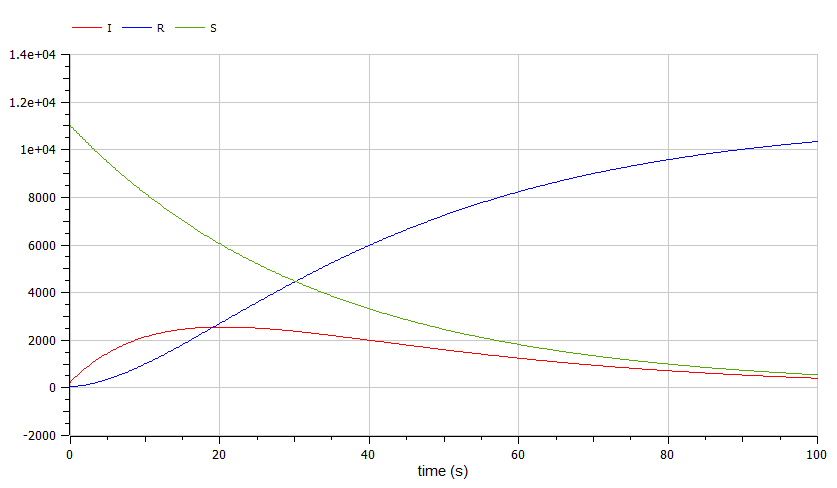
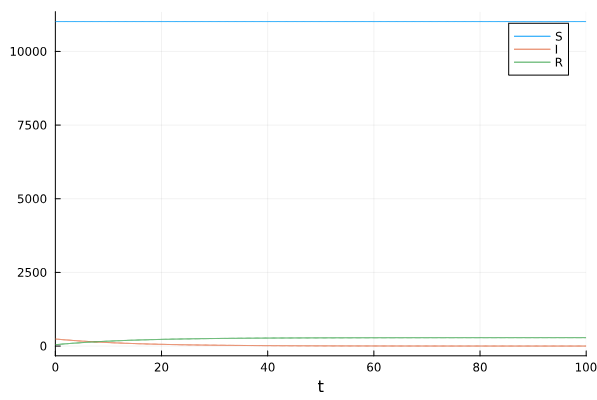
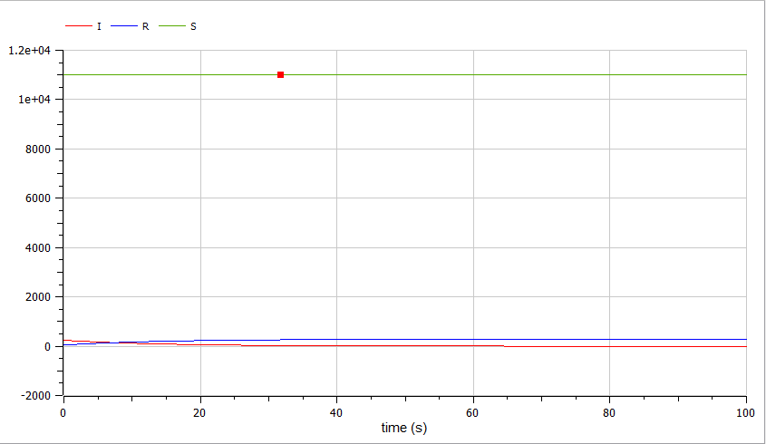
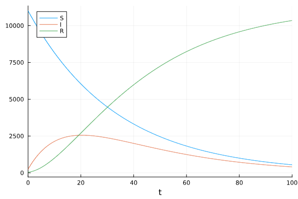

---
## Front matter
lang: ru-RU
title: Лабораторная работа №6
subtitle: Задача об эпидемии
author:
  - Камкина А. Л.
institute:
  - Российский университет дружбы народов, Москва, Россия

## i18n babel
babel-lang: russian
babel-otherlangs: english

## Formatting pdf
toc: false
toc-title: Содержание
slide_level: 2
aspectratio: 169
section-titles: true
theme: metropolis
header-includes:
 - \metroset{progressbar=frametitle,sectionpage=progressbar,numbering=fraction}
 - '\makeatletter'
 - '\beamer@ignorenonframefalse'
 - '\makeatother'
---

# Информация

## Докладчик

:::::::::::::: {.columns align=center}
::: {.column width="70%"}

  * Камкина Арина Леонидовна
  * студентка
  * Российский университет дружбы народов
  * [1032216456@pfur.ru](mailto:1032216456@pfur.ru)
  * <https://alkamkina.github.io/ru/>

:::
::: {.column width="25%"}


:::
::::::::::::::


## Цель работы

Построить графики к своей задаче об эпидемии, используя языки Julia и OpenModelica.

---
## Задача об эпидемии
Рассмотрим простейшую модель эпидемии. Предположим, что некая
популяция, состоящая из $N$ особей, (считаем, что популяция изолирована) подразделяется на три группы. Первая группа - это восприимчивые к болезни, но пока здоровые особи, обозначим их через $S(t)$. Вторая группа – это число инфицированных особей, которые также при этом являются распространителями инфекции, обозначим их $I(t)$. А третья группа, обозначающаяся через $R(t)$ – это здоровые особи с иммунитетом к болезни.

---
## Задача об эпидемии
До того, как число заболевших не превышает критического значения $I*$, считаем, что все больные изолированы и не заражают здоровых. Когда
$I(t)>I*$, тогда инфицирование способны заражать восприимчивых к болезни особей. 
Таким образом, скорость изменения числа $S(t)$ меняется по следующему
закону:
$$\begin{cases}
\dfrac{dS}{dt} = -aS, если I(0)<=I*\\ 
\dfrac{dS}{dt} = 0, если I(0)>I*
\end{cases}$$

---
## Задача об эпидемии
Поскольку каждая восприимчивая к болезни особь, которая, в конце концов,
заболевает, сама становится инфекционной, то скорость изменения числа
инфекционных особей представляет разность за единицу времени между
заразившимися и теми, кто уже болеет и лечится, т.е.:
$$\begin{cases}
\dfrac{dI}{dt} = aS - bI, если I(0)<=I*\\ 
\dfrac{dI}{dt} = -bI, если I(0)>I*
\end{cases}$$

---
## Задача об эпидемии
А скорость изменения выздоравливающих особей (при этом приобретающие
иммунитет к болезни)
$$\begin{cases}
\dfrac{dR}{dt} = bI
\end{cases}$$

Постоянные пропорциональности
$a = 0.03$ и $b = 0.07$, - это коэффициенты заболеваемости
и выздоровления соответственно, которые я выставила самостоятельно.

# Выполнение лабораторной работы
### Создание проекта (код на Julia)
```
using Plots
using DifferentialEquations

p = [0.73, 0.037, 0.52, 0.039]
u = [7.0, 16.0]
tspan = (0.0, 20.0)

function f(u, p, t)
    a, b, c, d = p
    x, y = u
    dx = -a*x+b*x*y
    dy = c*y-d*x*y
    return [dx, dy]
end

prob1 = ODEProblem(f, u, tspan, p)
sol1 = solve(prob1, Tsit5())
plot(sol1, label = ["x" "y"])
```
Полученный график(рис. @fig:001).

{#fig:001 width=70%}
---
Если хоти получить график при найденом стационарном состоянии, то заменяем значение $u$ на:
```
u = [0.52/0.039, 0.73/0.037]
```
Полученный график(рис. @fig:002).

{#fig:002 width=70%}
---
### Создание проекта (код на OpenModelica)
```
model lab5_1
parameter Real a=0.73;
parameter Real b=0.037;
parameter Real c=0.52;
parameter Real d=0.039;
parameter Real x0=7;
parameter Real y0=16;
Real x(start=x0);
Real y(start=y0);

equation
der(x)=-a*x+b*x*y;
der(y)=c*y-d*x*y;
end lab5_1;
```
Полученный график(рис. @fig:003).

{#fig:003 width=70%}
---
Если хоти получить график при найденом стационарном состоянии, то заменяем значение $u$ на:
```
parameter Real x0=c/d;
parameter Real y0=a/b;
```
Полученный график(рис. @fig:004).

{#fig:004 width=70%}
---

# Вывод
В процессе выполнения данной лабораторной работы я построила графики, используя Julia и OpenModelica, а также приобрела первые практические навыки работы с Julia и OpenModelica.