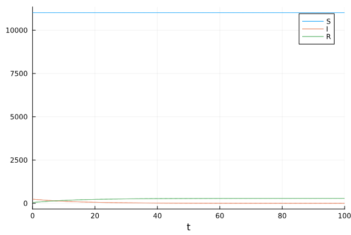
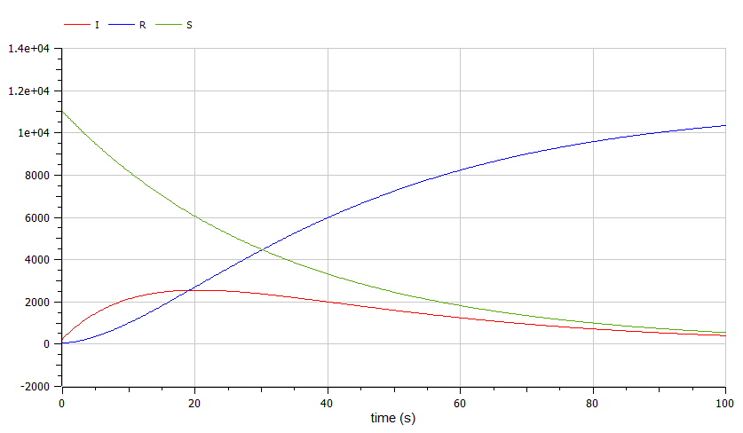
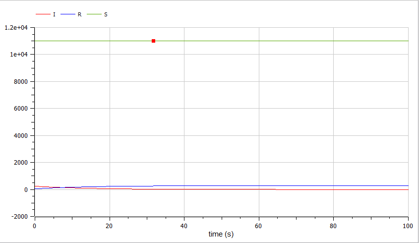
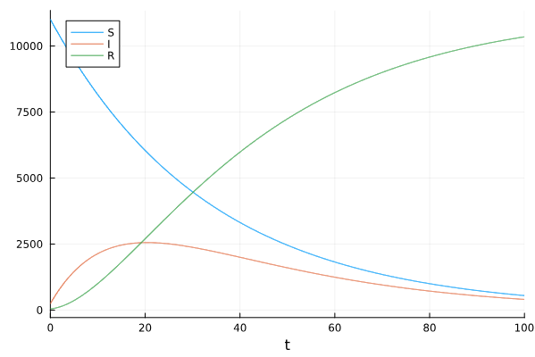

---
## Front matter
title: "Лабораторная работа №6"
subtitle: "Задача об эпидемии"
author: "Камкина Арина Леонидовна"

## Generic otions
lang: ru-RU
toc-title: "Содержание"

## Bibliography
bibliography: bib/cite.bib
csl: pandoc/csl/gost-r-7-0-5-2008-numeric.csl

## Pdf output format
toc: true # Table of contents
toc-depth: 2
lof: true # List of figures
lot: false # List of tables
fontsize: 12pt
linestretch: 1.5
papersize: a4
documentclass: scrreprt
## I18n polyglossia
polyglossia-lang:
  name: russian
  options:
	- spelling=modern
	- babelshorthands=true
polyglossia-otherlangs:
  name: english
## I18n babel
babel-lang: russian
babel-otherlangs: english
## Fonts
mainfont: PT Serif
romanfont: PT Serif
sansfont: PT Sans
monofont: PT Mono
mainfontoptions: Ligatures=TeX
romanfontoptions: Ligatures=TeX
sansfontoptions: Ligatures=TeX,Scale=MatchLowercase
monofontoptions: Scale=MatchLowercase,Scale=0.9
## Biblatex
biblatex: true
biblio-style: "gost-numeric"
biblatexoptions:
  - parentracker=true
  - backend=biber
  - hyperref=auto
  - language=auto
  - autolang=other*
  - citestyle=gost-numeric
## Pandoc-crossref LaTeX customization
figureTitle: "Рис."
tableTitle: "Таблица"
listingTitle: "Листинг"
lofTitle: "Список иллюстраций"
lotTitle: "Список таблиц"
lolTitle: "Листинги"
## Misc options
indent: true
header-includes:
  - \usepackage{indentfirst}
  - \usepackage{float} # keep figures where there are in the text
  - \floatplacement{figure}{H} # keep figures where there are in the text
---

# Цель работы
Построить графики к своей задаче об эпидемии, используя языки Julia и OpenModelica.

---
# Задание
На одном острове вспыхнула эпидемия. Известно, что из всех проживающих
на острове ($N=11 300$) в момент начала эпидемии ($t=0$) число заболевших людей (являющихся распространителями инфекции) $I(0)=240$, А число здоровых людей с иммунитетом к болезни $R(0)=46$. Таким образом, число людей восприимчивых к
болезни, но пока здоровых, в начальный момент времени $S(0)=N-I(0)- R(0)$.
Постройте графики изменения числа особей в каждой из трех групп.
Рассмотрите, как будет протекать эпидемия в случае: 
1. если $I(0)<=I*$
2. если $I(0)>I*$


---
# Теоретическое введение
Рассмотрим простейшую модель эпидемии. Предположим, что некая
популяция, состоящая из $N$ особей, (считаем, что популяция изолирована)
подразделяется на три группы. Первая группа - это восприимчивые к болезни, но пока здоровые особи, обозначим их через $S(t)$. Вторая группа – это число инфицированных особей, которые также при этом являются распространителями инфекции, обозначим их $I(t)$. А третья группа, обозначающаяся через $R(t)$ – это здоровые особи с иммунитетом к болезни.
До того, как число заболевших не превышает критического значения $I*$, считаем, что все больные изолированы и не заражают здоровых. Когда
$I(t)>I*$, тогда инфицирование способны заражать восприимчивых к болезни особей. 
Таким образом, скорость изменения числа $S(t)$ меняется по следующему
закону:
$$\begin{cases}
\dfrac{dS}{dt} = -aS, если I(0)<=I*\\ 
\dfrac{dS}{dt} = 0, если I(0)>I*
\end{cases}$$

Поскольку каждая восприимчивая к болезни особь, которая, в конце концов,
заболевает, сама становится инфекционной, то скорость изменения числа
инфекционных особей представляет разность за единицу времени между
заразившимися и теми, кто уже болеет и лечится, т.е.:
$$\begin{cases}
\dfrac{dI}{dt} = aS - bI, если I(0)<=I*\\ 
\dfrac{dI}{dt} = -bI, если I(0)>I*
\end{cases}$$

А скорость изменения выздоравливающих особей (при этом приобретающие
иммунитет к болезни)
$$\begin{cases}
\dfrac{dR}{dt} = bI
\end{cases}$$

Постоянные пропорциональности
$a = 0.03$ и $b = 0.07$, - это коэффициенты заболеваемости
и выздоровления соответственно, которые я выставила самостоятельно.

---
# Выполнение лабораторной работы
### Создание проекта (код на Julia) при I(0)<=I*
```
using Plots
using DifferentialEquations

N = 11300
S = N - I - R
I = 240
R = 46
p = [0.03, 0.07]
u = [S, I, R]
tspan = (0.0, 100.0)

function f(du, u, p, t)
    a, b = p
    S, I, R = u
    du[1] = 0
    du[2] = -b*d\u[2]
    du[3] = b*u[2]
end
prob1 = ODEProblem(f, u, tspan, p)
sol1 = solve(prob1, Tsit5())
plot(sol1, label = ["S" "I" "R"])
```
Полученный график при I(0)<=I*(рис. @fig:001).
{#fig:001 width=70%}
### Создание проекта (код на Julia) при I(0)>I*
```
using Plots
using DifferentialEquations

N = 11300
S = N - I - R
I = 240
R = 46
p = [0.03, 0.07]
u = [S, I, R]
tspan = (0.0, 100.0)

function f1(du, u, p, t)
    a, b = p
    S, I, R = u
    du[1] = -a*u[1]
    du[2] = a*u[1]-b*u[2]
    du[3] = b*u[2]
end
prob1 = ODEProblem(f1, u, tspan, p)
sol1 = solve(prob1, Tsit5())
plot(sol1, label = ["S" "I" "R"])
```
Полученный график при I(0)>I*(рис. @fig:002).
{#fig:001 width=70%}

---
### Создание проекта (код на OpenModelica) при I(0)<=I*
```
model lab_06
parameter Real N = 11300;
parameter Real a = 0.03;
parameter Real b = 0.07;
Real S(start = N-240-46);
Real I(start = 240);
Real R(start = 46);

equation
der(S) = 0;
der(I) = -b*I;
der(R) = b*I;


end lab_06;
```
Полученный график при I(0)<=I*(рис. @fig:001).
{#fig:003 width=70%}
### Создание проекта (код на OpenModelica) при I(0)>I*
```
model lab_06
parameter Real N = 11300;
parameter Real a = 0.03;
parameter Real b = 0.07;
Real S(start = N-240-46);
Real I(start = 240);
Real R(start = 46);

der(S) = -a*S;
der(I) = a*S-b*I;
der(R) = b*I;

end lab_06;
```
Полученный график при I(0)>I*(рис. @fig:002).
{#fig:004 width=70%}

---
# Анализ результатов

Были построены четыре графика на Julia и OpenModelica, на которых видно, что графики одинаковые.

---
# Вывод

В процессе выполнения данной лабораторной работы я построила графики, используя Julia и OpenModelica, а также приобрела первые практические навыки работы с Julia и OpenModelica.

---
# Список литературы

[1] Задача об эпидемии: http://twt.mpei.ac.ru/ochkov/mc8pro.book/5_text.htm

