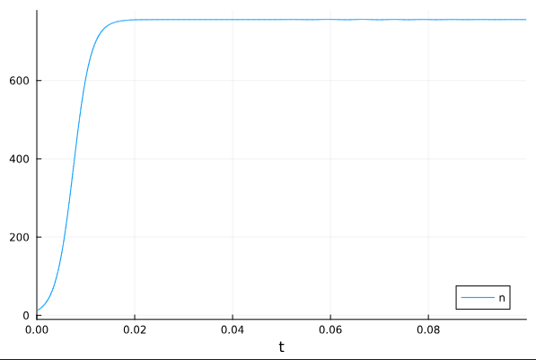

---
## Front matter
lang: ru-RU
title: Лабораторная работа №7
subtitle: Эффективность рекламы
author:
  - Камкина А. Л.
institute:
  - Российский университет дружбы народов, Москва, Россия

## i18n babel
babel-lang: russian
babel-otherlangs: english

## Formatting pdf
toc: false
toc-title: Содержание
slide_level: 2
aspectratio: 169
section-titles: true
theme: metropolis
header-includes:
 - \metroset{progressbar=frametitle,sectionpage=progressbar,numbering=fraction}
 - '\makeatletter'
 - '\beamer@ignorenonframefalse'
 - '\makeatother'
---

# Информация

## Докладчик

:::::::::::::: {.columns align=center}
::: {.column width="70%"}

  * Камкина Арина Леонидовна
  * студентка
  * Российский университет дружбы народов
  * [1032216456@pfur.ru](mailto:1032216456@pfur.ru)
  * <https://alkamkina.github.io/ru/>

:::
::: {.column width="25%"}


:::
::::::::::::::


## Цель работы
Построить графики к задаче об эффективности рекламы, используя языки Julia и OpenModelica.

---
## ## Эффективность рекламы
Модель рекламной кампании описывается следующими величинами.
Считаем, что $dn/dt$ - скорость изменения со временем числа потребителей,
узнавших о товаре и готовых его купить,
$t$ - время, прошедшее с начала рекламной
кампании, $n(t)$ - число уже информированных клиентов. Эта величина
пропорциональна числу покупателей, еще не знающих о нем, это описывается
следующим образом:
$a1(t)(N-n(t))$, где
$N$ - общее число потенциальных
платежеспособных покупателей,
$a1(t)>0$ - характеризует интенсивность
рекламной кампании (зависит от затрат на рекламу в данный момент времени).
Помимо этого, узнавшие о товаре потребители также распространяют полученную
информацию среди потенциальных покупателей, не знающих о нем. Этот вклад в рекламу описывается величиной
$a2(t)n(t)(N-n(t))$ , эта величина увеличивается с увеличением потребителей
узнавших о товаре. Математическая модель распространения рекламы описывается
уравнением:
$$\begin{cases}
\dfrac{dn}{dt} = (a1(t) + a2(t)n(t))*(N-n(t))
\end{cases}$$

---
## ## Эффективность рекламы
- При $a1(t)>>a2(t)$ получается модель типа модели Мальтуса
Мальтузианская модель роста, также называемая моделью Мальтуса — это экспоненциальный рост с постоянным темпом.

---
## Эффективность рекламы
- В обратном случае, при
$a1(t)<<a2(t)$ получаем уравнение логистической кривой:
Математическая модель, описывающая процессы, подобные развитию эпидемии называется уравнением Ферхюльста, или логистическим уравнением.

---
# Выполнение лабораторной работы
### Создание проекта (код на Julia) при $a1(t)>>a2(t)$
```
using Plots
using DifferentialEquations

n = 12
tspan1 = (0.0, 20)
p1 = [0.73, 0.000013, 756]

function f(n, p, t)
    a1, a2, N = p
    return (a1 + a2*n)*(N-n)
end

prob1 = ODEProblem(f, n, tspan1, p1)
sol1 = solve(prob1, Tsit5())
plot(sol1, label = 'n')
```
Полученный график при $a1(t)>>a2(t)$ (рис. @fig:001).
{#fig:001 width=70%}

---
### Создание проекта (код на OpenModelica) при $a1(t)>>a2(t)$
```
model lab_07

Real n(start = 17);
parameter Real a1 = 0.73;
parameter Real a2 = 0.000013;
parameter Real N = 756;

equation
der(n) = (a1 + a2*n)*(N-n);

end lab_07;
```
Полученный график при $a1(t)>>a2(t)$(рис. @fig:001).
{#fig:002 width=70%}

---
### Создание проекта (код на Julia) при $a1(t)<<a2(t)$
```
using Plots
using DifferentialEquations

n = 12
tspan2 = (0.0, 0.1)
p2 = [0.000013, 0.73, 756]

function f(n, p, t)
    a1, a2, N = p
    return (a1 + a2*n)*(N-n)
end

prob2 = ODEProblem(f, n, tspan2, p2)
sol2 = solve(prob2, Tsit5())
plot(sol2, label = 'n')
```
Полученный график при $a1(t)<<a2(t)$ (рис. @fig:003).
{#fig:003 width=70%}

---
### Создание проекта (код на OpenModelica) при $a1(t)<<a2(t)$
```
model lab_07

Real n(start = 17);
parameter Real a1 = 0.000013;
parameter Real a2 = 0.73;
parameter Real N = 756;

equation
der(n) = (a1 + a2*n)*(N-n);

end lab_07;
```
Полученный график при $a1(t)<<a2(t)$(рис. @fig:004).
{#fig:004 width=70%}

---
### Создание проекта (код на Julia) при $a1(t)<<a2(t)$
```
using Plots
using DifferentialEquations

n = 12
tspan3 = (0.0, 2)
p3 = [0.55, 0.33, 756]

function f3(n, p, t)
    a1, a2, N = p
    return (a1*sin(t) + a2*sin(5*t)*n)*(N-n)
end

prob3 = ODEProblem(f3, n, tspan3, p3)
sol3 = solve(prob3, Tsit5())
plot(sol3, label = 'n')
```
Полученный график (рис. @fig:005).
{#fig:005 width=70%}

---
### Создание проекта (код на OpenModelica)
```
model lab_07

Real n(start = 17);
parameter Real a1 = 0.55;
parameter Real a2 = 0.33;
parameter Real N = 756;

equation
der(n) = (a1*sin(time) + a2*sin(5*time)*n)*(N-n);

end lab_07;
```
Полученный график (рис. @fig:006).
{#fig:006 width=70%}

---
# Вывод
В процессе выполнения данной лабораторной работы я построила графики, используя Julia и OpenModelica, а также приобрела первые практические навыки работы с Julia и OpenModelica.