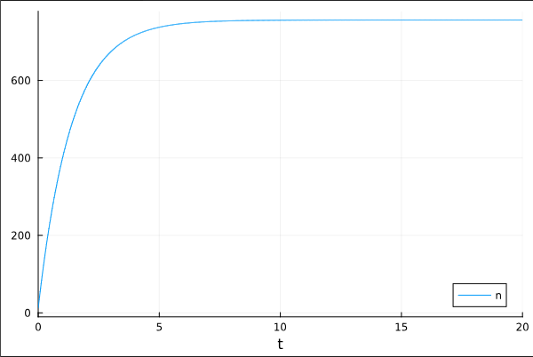
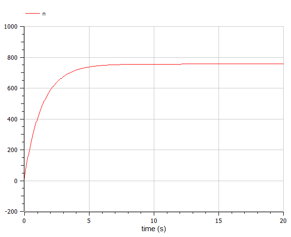
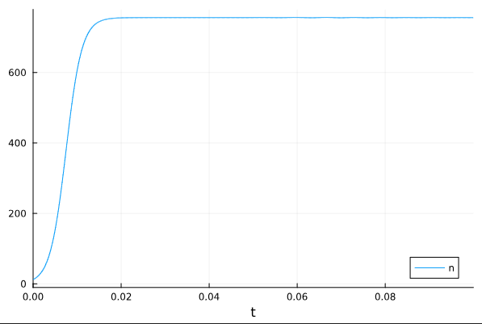
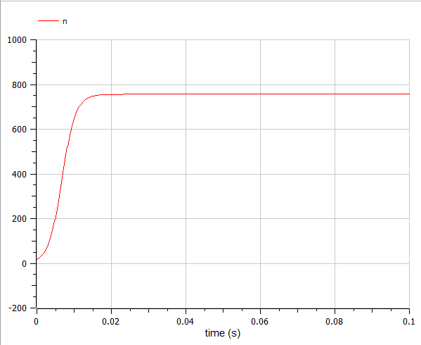
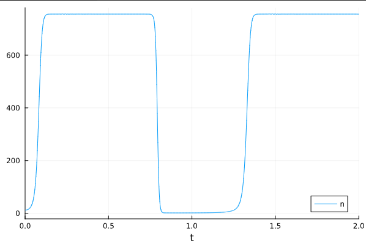
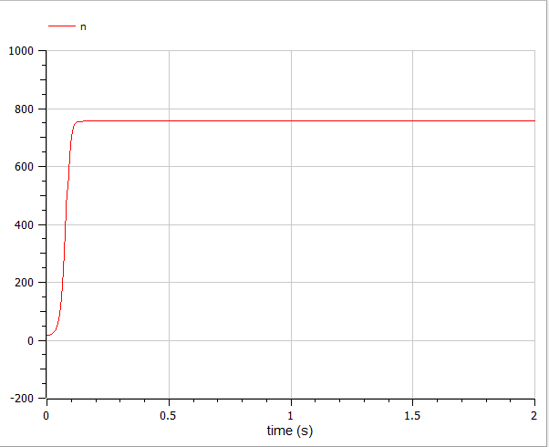

---
## Front matter
title: "Лабораторная работа №7"
subtitle: "Эффективность рекламы"
author: "Камкина Арина Леонидовна"

## Generic otions
lang: ru-RU
toc-title: "Содержание"

## Bibliography
bibliography: bib/cite.bib
csl: pandoc/csl/gost-r-7-0-5-2008-numeric.csl

## Pdf output format
toc: true # Table of contents
toc-depth: 2
lof: true # List of figures
lot: false # List of tables
fontsize: 12pt
linestretch: 1.5
papersize: a4
documentclass: scrreprt
## I18n polyglossia
polyglossia-lang:
  name: russian
  options:
	- spelling=modern
	- babelshorthands=true
polyglossia-otherlangs:
  name: english
## I18n babel
babel-lang: russian
babel-otherlangs: english
## Fonts
mainfont: PT Serif
romanfont: PT Serif
sansfont: PT Sans
monofont: PT Mono
mainfontoptions: Ligatures=TeX
romanfontoptions: Ligatures=TeX
sansfontoptions: Ligatures=TeX,Scale=MatchLowercase
monofontoptions: Scale=MatchLowercase,Scale=0.9
## Biblatex
biblatex: true
biblio-style: "gost-numeric"
biblatexoptions:
  - parentracker=true
  - backend=biber
  - hyperref=auto
  - language=auto
  - autolang=other*
  - citestyle=gost-numeric
## Pandoc-crossref LaTeX customization
figureTitle: "Рис."
tableTitle: "Таблица"
listingTitle: "Листинг"
lofTitle: "Список иллюстраций"
lotTitle: "Список таблиц"
lolTitle: "Листинги"
## Misc options
indent: true
header-includes:
  - \usepackage{indentfirst}
  - \usepackage{float} # keep figures where there are in the text
  - \floatplacement{figure}{H} # keep figures where there are in the text
---

# Цель работы
Построить графики к задаче об эффективности рекламы, используя языки Julia и OpenModelica.

---
# Задание
Постройте график распространения рекламы, математическая модель которой описывается
следующим уравнением:

1. 
$$\begin{cases}
\dfrac{dn}{dt} = (0.73 + 0.000013n(t))*(N-n(t))
\end{cases}$$
2. 
$$\begin{cases}
\dfrac{dn}{dt} = (0.000013 + 0.73n(t))*(N-n(t))
\end{cases}$$
3. 
$$\begin{cases}
\dfrac{dn}{dt} = (0.55sin(t) + 0.33n(t)sin(5t))*(N-n(t))
\end{cases}$$

При этом объем аудитории $N = 756$ , в начальный момент о товаре знает $n = 17$ человек.

---
# Теоретическое введение
Организуется рекламная кампания нового товара или услуги. Необходимо,
чтобы прибыль будущих продаж с избытком покрывала издержки на рекламу.
Вначале расходы могут превышать прибыль, поскольку лишь малая часть
потенциальных покупателей будет информирована о новинке. Затем, при
увеличении числа продаж, возрастает и прибыль, и, наконец, наступит момент,
когда рынок насытиться, и рекламировать товар станет бесполезным.

Модель рекламной кампании описывается следующими величинами.
Считаем, что $dn/dt$ - скорость изменения со временем числа потребителей,
узнавших о товаре и готовых его купить,
$t$ - время, прошедшее с начала рекламной
кампании, $n(t)$ - число уже информированных клиентов. Эта величина
пропорциональна числу покупателей, еще не знающих о нем, это описывается
следующим образом:
$a1(t)(N-n(t))$, где
$N$ - общее число потенциальных
платежеспособных покупателей,
$a1(t)>0$ - характеризует интенсивность
рекламной кампании (зависит от затрат на рекламу в данный момент времени).
Помимо этого, узнавшие о товаре потребители также распространяют полученную
информацию среди потенциальных покупателей, не знающих о нем. Этот вклад в рекламу описывается величиной
$a2(t)n(t)(N-n(t))$ , эта величина увеличивается с увеличением потребителей
узнавших о товаре. Математическая модель распространения рекламы описывается
уравнением:
$$\begin{cases}
\dfrac{dn}{dt} = (a1(t) + a2(t)n(t))*(N-n(t))
\end{cases}$$

- При $a1(t)>>a2(t)$ получается модель типа модели Мальтуса
Мальтузианская модель роста, также называемая моделью Мальтуса — это экспоненциальный рост с постоянным темпом [1].
- В обратном случае, при
$a1(t)<<a2(t)$ получаем уравнение логистической кривой:
Математическая модель, описывающая процессы, подобные развитию эпидемии называется уравнением Ферхюльста, или логистическим уравнением [2].
---
# Выполнение лабораторной работы
### Создание проекта (код на Julia) при $a1(t)>>a2(t)$
```
using Plots
using DifferentialEquations

n = 12
tspan1 = (0.0, 20)
p1 = [0.73, 0.000013, 756]

function f(n, p, t)
    a1, a2, N = p
    return (a1 + a2*n)*(N-n)
end

prob1 = ODEProblem(f, n, tspan1, p1)
sol1 = solve(prob1, Tsit5())
plot(sol1, label = 'n')
```
Полученный график при $a1(t)>>a2(t)$ (рис. @fig:001).
{#fig:001 width=70%}

### Создание проекта (код на OpenModelica) при $a1(t)>>a2(t)$
```
model lab_07

Real n(start = 17);
parameter Real a1 = 0.73;
parameter Real a2 = 0.000013;
parameter Real N = 756;

equation
der(n) = (a1 + a2*n)*(N-n);

end lab_07;
```
Полученный график при $a1(t)>>a2(t)$(рис. @fig:001).
{#fig:002 width=70%}

---
### Создание проекта (код на Julia) при $a1(t)<<a2(t)$
```
using Plots
using DifferentialEquations

n = 12
tspan2 = (0.0, 0.1)
p2 = [0.000013, 0.73, 756]

function f(n, p, t)
    a1, a2, N = p
    return (a1 + a2*n)*(N-n)
end

prob2 = ODEProblem(f, n, tspan2, p2)
sol2 = solve(prob2, Tsit5())
plot(sol2, label = 'n')
```
Полученный график при $a1(t)<<a2(t)$ (рис. @fig:003).
{#fig:003 width=70%}

### Создание проекта (код на OpenModelica) при $a1(t)<<a2(t)$
```
model lab_07

Real n(start = 17);
parameter Real a1 = 0.000013;
parameter Real a2 = 0.73;
parameter Real N = 756;

equation
der(n) = (a1 + a2*n)*(N-n);

end lab_07;
```
Полученный график при $a1(t)<<a2(t)$(рис. @fig:004).
{#fig:004 width=70%}

---
### Создание проекта (код на Julia) при $a1(t)<<a2(t)$
```
using Plots
using DifferentialEquations

n = 12
tspan3 = (0.0, 2)
p3 = [0.55, 0.33, 756]

function f3(n, p, t)
    a1, a2, N = p
    return (a1*sin(t) + a2*sin(5*t)*n)*(N-n)
end

prob3 = ODEProblem(f3, n, tspan3, p3)
sol3 = solve(prob3, Tsit5())
plot(sol3, label = 'n')
```
Полученный график (рис. @fig:005).
{#fig:005 width=70%}

### Создание проекта (код на OpenModelica)
```
model lab_07

Real n(start = 17);
parameter Real a1 = 0.55;
parameter Real a2 = 0.33;
parameter Real N = 756;

equation
der(n) = (a1*sin(time) + a2*sin(5*time)*n)*(N-n);

end lab_07;
```
Полученный график (рис. @fig:006).
{#fig:006 width=70%}
---
# Анализ результатов

Были построены четыре графика на Julia и OpenModelica, на которых видно, что графики одинаковые в перовм и втором случаях, однако, когда появилась тригоноиетрическая функция график на Julia повторяется (следует синусоидальной функции), а на OpenModelica дошел до максимума и рнее отпускается.

---
# Вывод

В процессе выполнения данной лабораторной работы я построила графики, используя Julia и OpenModelica, а также приобрела первые практические навыки работы с Julia и OpenModelica.

---
# Список литературы

[1] Модель Мальтуса: https://ru.wikipedia.org/wiki/%D0%9C%D0%B0%D0%BB%D1%8C%D1%82%D1%83%D0%B7%D0%B8%D0%B0%D0%BD%D1%81%D0%BA%D0%B0%D1%8F_%D0%BC%D0%BE%D0%B4%D0%B5%D0%BB%D1%8C_%D1%80%D0%BE%D1%81%D1%82%D0%B0

[2] Логистическая кривая: https://habr.com/ru/articles/493620/

