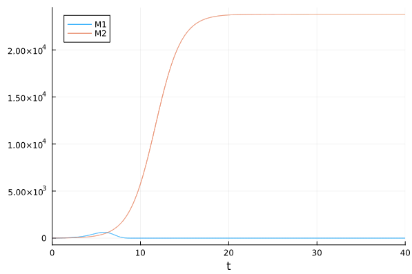
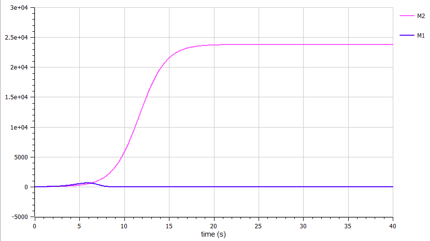

---
## Front matter
lang: ru-RU
title: Лабораторная работа №8
subtitle: Модель конкуренции двух фирм
author:
  - Камкина А. Л.
institute:
  - Российский университет дружбы народов, Москва, Россия

## i18n babel
babel-lang: russian
babel-otherlangs: english

## Formatting pdf
toc: false
toc-title: Содержание
slide_level: 2
aspectratio: 169
section-titles: true
theme: metropolis
header-includes:
 - \metroset{progressbar=frametitle,sectionpage=progressbar,numbering=fraction}
 - '\makeatletter'
 - '\beamer@ignorenonframefalse'
 - '\makeatother'
---

# Информация

## Докладчик

:::::::::::::: {.columns align=center}
::: {.column width="70%"}

  * Камкина Арина Леонидовна
  * студентка
  * Российский университет дружбы народов
  * [1032216456@pfur.ru](mailto:1032216456@pfur.ru)
  * <https://alkamkina.github.io/ru/>

:::
::: {.column width="25%"}


:::
::::::::::::::


## Цель работы
Построить графики к задаче, используя языки Julia и OpenModelica.

---
## Дуополия
*Дуополия* — это экономическая ситуация, когда на рынке конкурентную борьбу ведут только две компании, не связанные между собой никакими соглашениями.

---
## *Случай 1* 
Рассмотрим две фирмы, производящие взаимозаменяемые товары
одинакового качества и находящиеся в одной рыночной нише. Считаем, что в рамках
нашей модели конкурентная борьба ведётся только рыночными методами. То есть,
конкуренты могут влиять на противника путем изменения параметров своего
производства: себестоимость, время цикла, но не могут прямо вмешиваться в
ситуацию на рынке («назначать» цену или влиять на потребителей каким-либо иным
способом.) Будем считать, что постоянные издержки пренебрежимо малы, и в
модели учитывать не будем. В этом случае динамика изменения объемов продаж
фирмы 1 и фирмы 2 описывается следующей системой уравнений:
$$\begin{cases}
\frac{d M_1}{dθ} = M_1 - \dfrac{b}{c_1} M_1 M_2 - \dfrac{a_1}{c_1} M_1^2\\
\frac{d M_2}{dθ} = \dfrac{c_2}{c_1} M_1 - \dfrac{b}{c_1} M_1 M_2 - \dfrac{a_2}{c_1} M_2^2
\end{cases}$$

---
## *Случай 2* 
Рассмотрим модель, когда, помимо экономического фактора
влияния (изменение себестоимости, производственного цикла, использование
кредита и т.п.), используются еще и социально-психологические факторы –
формирование общественного предпочтения одного товара другому, не зависимо от
их качества и цены. В этом случае взаимодействие двух фирм будет зависеть друг
от друга, соответственно коэффициент перед M_1 и M_ 2 будет отличаться. Пусть в
рамках рассматриваемой модели динамика изменения объемов продаж фирмы 1 и
фирмы 2 описывается следующей системой уравнений:
$$\begin{cases}
\frac{d M_1}{dθ} = M_1 - (\dfrac{b}{c_1}+0.00017) M_1 M_2 - \dfrac{a_1}{c_1} M_1^2\\
\frac{d M_2}{dθ} = \dfrac{c_2}{c_1} M_1 - \dfrac{b}{c_1} M_1 M_2 - \dfrac{a_2}{c_1} M_2^2
\end{cases}$$

---
# Выполнение лабораторной работы
### Создание проекта (код на Julia) *случай 1*
```
using Plots
using DifferentialEquations

p_cr = 39
N = 91
q = 1
t1 = 31
t2 = 28
p1 = 11.2
p2 = 15.5

a1 = p_cr/(t1*t1*p1*p1*N*q)
a2 = p_cr/(t2*t2*p2*p2*N*q)
b = p_cr/(t1*t1*p1*p1*t2*t2*p2*p2*N*q)
c1 = (p_cr-p1)/(t1*p1)
c2 = (p_cr-p2)/(t2*p2)

tspan = (0.0, 40)
u = [7.7, 8.8]
p = [c1, c2, b, a1, a2]

function f1(du, u, p, t)
    M1, M2 = u
    c1, c2, b, a1, a2 = p
    du[1] = (c1/c1)*M1 - (b/c1)*M1*M2 - (a1/c1)*M1*M1
    du[2] = (c2/c1)*M2 - (b/c1)*M1*M2 - (a2/c1)*M2*M2
end

prob1 = ODEProblem(f1, u, tspan, p)
sol1 = solve(prob1, Tsit5())
plot(sol1, label = ["M1" "M2"])
```
Полученный график  *случай 1* (рис. @fig:001).
{#fig:001 width=70%}

---
### Создание проекта (код на OpenModelica) *случай 1*
```
model lab_08

Real M1(start = 7.7);
Real M2(start = 8.8);

parameter Real p_cr = 39;
parameter Real N = 91;
parameter Real q = 1;
parameter Real t1 = 31;
parameter Real t2 = 28;
parameter Real p1 = 11.2;
parameter Real p2 = 15.5;

parameter Real a1 = p_cr/(t1*t1*p1*p1*N*q);
parameter Real a2 = p_cr/(t2*t2*p2*p2*N*q);
parameter Real b = p_cr/(t1*t1*p1*p1*t2*t2*p2*p2*N*q);
parameter Real c1 = (p_cr-p1)/(t1*p1);
parameter Real c2 = (p_cr-p2)/(t2*p2);

equation
der(M1) = (c1/c1)*M1 - (b/c1)*M1*M2 - (a1/c1)*M1*M1;
der(M2) = (c2/c1)*M2 - (b/c1)*M1*M2 - (a2/c1)*M2*M2;
end lab_08;
```
Полученный график *случай 1*(рис. @fig:001).
{#fig:002 width=70%}

---
### Создание проекта (код на Julia) *случай 2*
```
using Plots
using DifferentialEquations

p_cr = 39
N = 91
q = 1
t1 = 31
t2 = 28
p1 = 11.2
p2 = 15.5

a1 = p_cr/(t1*t1*p1*p1*N*q)
a2 = p_cr/(t2*t2*p2*p2*N*q)
b = p_cr/(t1*t1*p1*p1*t2*t2*p2*p2*N*q)
c1 = (p_cr-p1)/(t1*p1)
c2 = (p_cr-p2)/(t2*p2)

tspan = (0.0, 40)
u = [7.7, 8.8]
p = [c1, c2, b, a1, a2]

function f2(du, u, p, t)
    M1, M2 = u
    c1, c2, b, a1, a2 = p
    du[1] = (c1/c1)*M1 - ((b+0.00017)/c1)*M1*M2 - (a1/c1)*M1*M1
    du[2] = (c2/c1)*M2 - (b/c1)*M1*M2 - (a2/c1)*M2*M2
end

prob1 = ODEProblem(f2, u, tspan, p)
sol1 = solve(prob1, Tsit5())
plot(sol1, label = ["M1" "M2"])
```
Полученный график *случай 2* (рис. @fig:003).
{#fig:003 width=70%}

---
### Создание проекта (код на OpenModelica) *случай 2*
```
model lab_08

Real M1(start = 7.7);
Real M2(start = 8.8);

parameter Real p_cr = 39;
parameter Real N = 91;
parameter Real q = 1;
parameter Real t1 = 31;
parameter Real t2 = 28;
parameter Real p1 = 11.2;
parameter Real p2 = 15.5;

parameter Real a1 = p_cr/(t1*t1*p1*p1*N*q);
parameter Real a2 = p_cr/(t2*t2*p2*p2*N*q);
parameter Real b = p_cr/(t1*t1*p1*p1*t2*t2*p2*p2*N*q);
parameter Real c1 = (p_cr-p1)/(t1*p1);
parameter Real c2 = (p_cr-p2)/(t2*p2);

equation
der(M1) = (c1/c1)*M1 - ((b+0.00017)/c1)*M1*M2 - (a1/c1)*M1*M1;
der(M2) = (c2/c1)*M2 - (b/c1)*M1*M2 - (a2/c1)*M2*M2;
end lab_08;
```
Полученный график при *случай 2*(рис. @fig:004).
{#fig:004 width=70%}

---
# Вывод
В процессе выполнения данной лабораторной работы я построила графики, используя Julia и OpenModelica, а также приобрела практические навыки работы с Julia и OpenModelica.