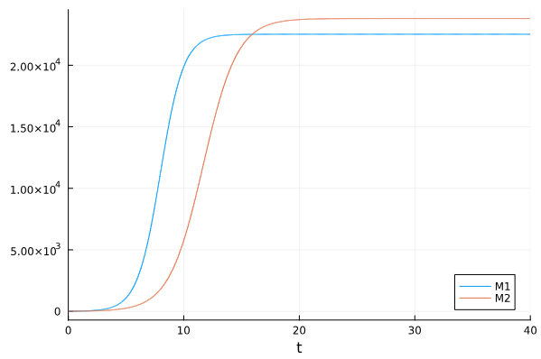
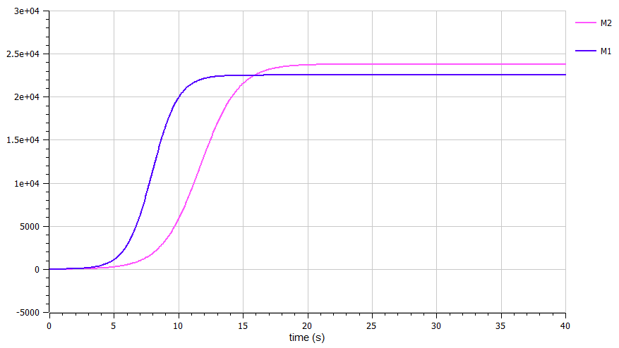
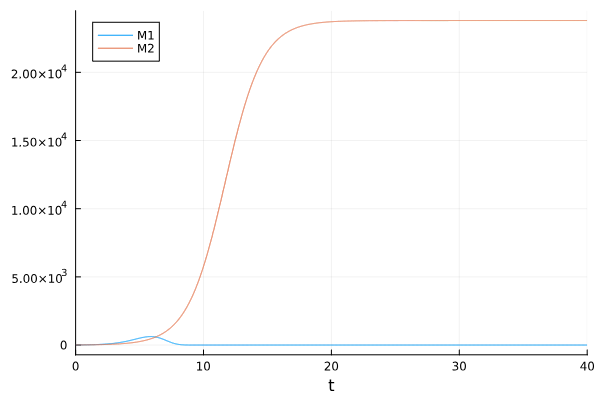
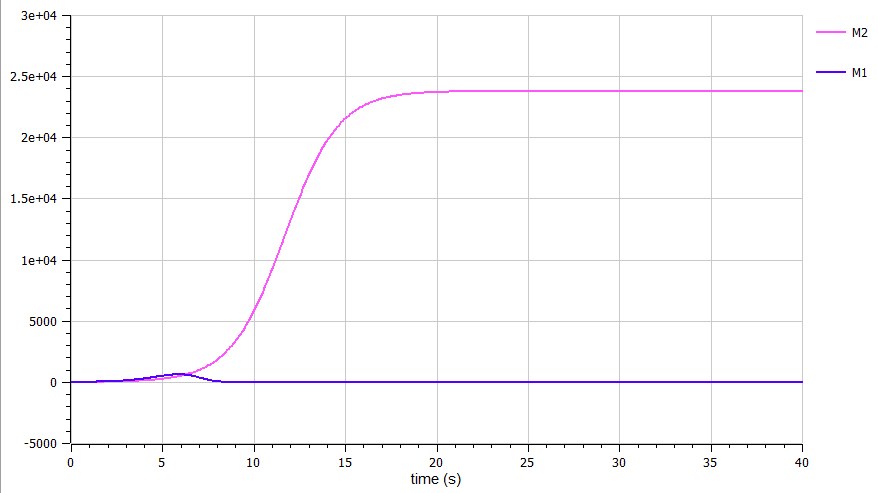

---
## Front matter
title: "Лабораторная работа №8"
subtitle: "Модель конкуренции двух фирм"
author: "Камкина Арина Леонидовна"

## Generic otions
lang: ru-RU
toc-title: "Содержание"

## Bibliography
bibliography: bib/cite.bib
csl: pandoc/csl/gost-r-7-0-5-2008-numeric.csl

## Pdf output format
toc: true # Table of contents
toc-depth: 2
lof: true # List of figures
lot: false # List of tables
fontsize: 12pt
linestretch: 1.5
papersize: a4
documentclass: scrreprt
## I18n polyglossia
polyglossia-lang:
  name: russian
  options:
	- spelling=modern
	- babelshorthands=true
polyglossia-otherlangs:
  name: english
## I18n babel
babel-lang: russian
babel-otherlangs: english
## Fonts
mainfont: PT Serif
romanfont: PT Serif
sansfont: PT Sans
monofont: PT Mono
mainfontoptions: Ligatures=TeX
romanfontoptions: Ligatures=TeX
sansfontoptions: Ligatures=TeX,Scale=MatchLowercase
monofontoptions: Scale=MatchLowercase,Scale=0.9
## Biblatex
biblatex: true
biblio-style: "gost-numeric"
biblatexoptions:
  - parentracker=true
  - backend=biber
  - hyperref=auto
  - language=auto
  - autolang=other*
  - citestyle=gost-numeric
## Pandoc-crossref LaTeX customization
figureTitle: "Рис."
tableTitle: "Таблица"
listingTitle: "Листинг"
lofTitle: "Список иллюстраций"
lotTitle: "Список таблиц"
lolTitle: "Листинги"
## Misc options
indent: true
header-includes:
  - \usepackage{indentfirst}
  - \usepackage{float} # keep figures where there are in the text
  - \floatplacement{figure}{H} # keep figures where there are in the text
---

# Цель работы
Построить графики к задаче, используя языки Julia и OpenModelica.

---
# Задание
1. Построить графики изменения оборотных средств фирмы 1 и фирмы 2 без
учета постоянных издержек и с веденной нормировкой для случая 1:
$$\begin{cases}
\frac{d M_1}{dθ} = M_1 - \dfrac{b}{c_1} M_1 M_2 - \dfrac{a_1}{c_1} M_1^2\\
\frac{d M_2}{dθ} = \dfrac{c_2}{c_1} M_1 - \dfrac{b}{c_1} M_1 M_2 - \dfrac{a_2}{c_1} M_2^2
\end{cases}$$
2. Построить графики изменения оборотных средств фирмы 1 и фирмы 2 без
учета постоянных издержек и с веденной нормировкой для случая 2:
$$\begin{cases}
\frac{d M_1}{dθ} = M_1 - (\dfrac{b}{c_1}+0.00017) M_1 M_2 - \dfrac{a_1}{c_1} M_1^2\\
\frac{d M_2}{dθ} = \dfrac{c_2}{c_1} M_1 - \dfrac{b}{c_1} M_1 M_2 - \dfrac{a_2}{c_1} M_2^2
\end{cases}$$

При этом объем аудитории начальные условия $M_0^1 = 7.7, M_0^2 = 8.8, p_cr = 39, N = 91, q = 1, ꚍ_1 = 31, ꚍ_2 = 28, p̃_1 = 11.2, p̃_2 = 15.5$, где 

> $N$ – число потребителей производимого продукта

> $ꚍ$ – длительность производственного цикла

> $p$ – рыночная цена товара

> $p̃$ – себестоимость продукта, то есть переменные издержки на производство единицы продукции

> $q$ – максимальная потребность одного человека в продукте в единицу времени

> $θ = t/c_1$ - безразмерное время

---
# Теоретическое введение
*Дуополия* — это экономическая ситуация, когда на рынке конкурентную борьбу ведут только две компании, не связанные между собой никакими соглашениями[1].

*Случай 1.* 
Рассмотрим две фирмы, производящие взаимозаменяемые товары
одинакового качества и находящиеся в одной рыночной нише. Считаем, что в рамках
нашей модели конкурентная борьба ведётся только рыночными методами. То есть,
конкуренты могут влиять на противника путем изменения параметров своего
производства: себестоимость, время цикла, но не могут прямо вмешиваться в
ситуацию на рынке («назначать» цену или влиять на потребителей каким-либо иным
способом.) Будем считать, что постоянные издержки пренебрежимо малы, и в
модели учитывать не будем. В этом случае динамика изменения объемов продаж
фирмы 1 и фирмы 2 описывается следующей системой уравнений:
$$\begin{cases}
\frac{d M_1}{dθ} = M_1 - \dfrac{b}{c_1} M_1 M_2 - \dfrac{a_1}{c_1} M_1^2\\
\frac{d M_2}{dθ} = \dfrac{c_2}{c_1} M_1 - \dfrac{b}{c_1} M_1 M_2 - \dfrac{a_2}{c_1} M_2^2
\end{cases}$$

*Случай 2.* 
Рассмотрим модель, когда, помимо экономического фактора
влияния (изменение себестоимости, производственного цикла, использование
кредита и т.п.), используются еще и социально-психологические факторы –
формирование общественного предпочтения одного товара другому, не зависимо от
их качества и цены. В этом случае взаимодействие двух фирм будет зависеть друг
от друга, соответственно коэффициент перед M_1 и M_ 2 будет отличаться. Пусть в
рамках рассматриваемой модели динамика изменения объемов продаж фирмы 1 и
фирмы 2 описывается следующей системой уравнений:
$$\begin{cases}
\frac{d M_1}{dθ} = M_1 - (\dfrac{b}{c_1}+0.00017) M_1 M_2 - \dfrac{a_1}{c_1} M_1^2\\
\frac{d M_2}{dθ} = \dfrac{c_2}{c_1} M_1 - \dfrac{b}{c_1} M_1 M_2 - \dfrac{a_2}{c_1} M_2^2
\end{cases}$$

---
# Выполнение лабораторной работы
### Создание проекта (код на Julia) *случай 1*
```
using Plots
using DifferentialEquations

p_cr = 39
N = 91
q = 1
t1 = 31
t2 = 28
p1 = 11.2
p2 = 15.5

a1 = p_cr/(t1*t1*p1*p1*N*q)
a2 = p_cr/(t2*t2*p2*p2*N*q)
b = p_cr/(t1*t1*p1*p1*t2*t2*p2*p2*N*q)
c1 = (p_cr-p1)/(t1*p1)
c2 = (p_cr-p2)/(t2*p2)

tspan = (0.0, 40)
u = [7.7, 8.8]
p = [c1, c2, b, a1, a2]

function f1(du, u, p, t)
    M1, M2 = u
    c1, c2, b, a1, a2 = p
    du[1] = (c1/c1)*M1 - (b/c1)*M1*M2 - (a1/c1)*M1*M1
    du[2] = (c2/c1)*M2 - (b/c1)*M1*M2 - (a2/c1)*M2*M2
end

prob1 = ODEProblem(f1, u, tspan, p)
sol1 = solve(prob1, Tsit5())
plot(sol1, label = ["M1" "M2"])
```
Полученный график  *случай 1* (рис. @fig:001).
{#fig:001 width=70%}

### Создание проекта (код на OpenModelica) *случай 1*
```
model lab_08

Real M1(start = 7.7);
Real M2(start = 8.8);

parameter Real p_cr = 39;
parameter Real N = 91;
parameter Real q = 1;
parameter Real t1 = 31;
parameter Real t2 = 28;
parameter Real p1 = 11.2;
parameter Real p2 = 15.5;

parameter Real a1 = p_cr/(t1*t1*p1*p1*N*q);
parameter Real a2 = p_cr/(t2*t2*p2*p2*N*q);
parameter Real b = p_cr/(t1*t1*p1*p1*t2*t2*p2*p2*N*q);
parameter Real c1 = (p_cr-p1)/(t1*p1);
parameter Real c2 = (p_cr-p2)/(t2*p2);

equation
der(M1) = (c1/c1)*M1 - (b/c1)*M1*M2 - (a1/c1)*M1*M1;
der(M2) = (c2/c1)*M2 - (b/c1)*M1*M2 - (a2/c1)*M2*M2;
end lab_08;
```
Полученный график *случай 1*(рис. @fig:001).
{#fig:002 width=70%}

---
### Создание проекта (код на Julia) *случай 2*
```
using Plots
using DifferentialEquations

p_cr = 39
N = 91
q = 1
t1 = 31
t2 = 28
p1 = 11.2
p2 = 15.5

a1 = p_cr/(t1*t1*p1*p1*N*q)
a2 = p_cr/(t2*t2*p2*p2*N*q)
b = p_cr/(t1*t1*p1*p1*t2*t2*p2*p2*N*q)
c1 = (p_cr-p1)/(t1*p1)
c2 = (p_cr-p2)/(t2*p2)

tspan = (0.0, 40)
u = [7.7, 8.8]
p = [c1, c2, b, a1, a2]

function f2(du, u, p, t)
    M1, M2 = u
    c1, c2, b, a1, a2 = p
    du[1] = (c1/c1)*M1 - ((b+0.00017)/c1)*M1*M2 - (a1/c1)*M1*M1
    du[2] = (c2/c1)*M2 - (b/c1)*M1*M2 - (a2/c1)*M2*M2
end

prob1 = ODEProblem(f2, u, tspan, p)
sol1 = solve(prob1, Tsit5())
plot(sol1, label = ["M1" "M2"])
```
Полученный график *случай 2* (рис. @fig:003).
{#fig:003 width=70%}

### Создание проекта (код на OpenModelica) *случай 2*
```
model lab_08

Real M1(start = 7.7);
Real M2(start = 8.8);

parameter Real p_cr = 39;
parameter Real N = 91;
parameter Real q = 1;
parameter Real t1 = 31;
parameter Real t2 = 28;
parameter Real p1 = 11.2;
parameter Real p2 = 15.5;

parameter Real a1 = p_cr/(t1*t1*p1*p1*N*q);
parameter Real a2 = p_cr/(t2*t2*p2*p2*N*q);
parameter Real b = p_cr/(t1*t1*p1*p1*t2*t2*p2*p2*N*q);
parameter Real c1 = (p_cr-p1)/(t1*p1);
parameter Real c2 = (p_cr-p2)/(t2*p2);

equation
der(M1) = (c1/c1)*M1 - ((b+0.00017)/c1)*M1*M2 - (a1/c1)*M1*M1;
der(M2) = (c2/c1)*M2 - (b/c1)*M1*M2 - (a2/c1)*M2*M2;
end lab_08;
```
Полученный график при *случай 2*(рис. @fig:004).
{#fig:004 width=70%}

---
# Анализ результатов

Были построены четыре графика на Julia и OpenModelica, на которых видно, что графики абсолютно одинаковые в первом и втором случаях.

---
# Вывод

В процессе выполнения данной лабораторной работы я построила графики, используя Julia и OpenModelica, а также приобрела практические навыки работы с Julia и OpenModelica.

---
# Список литературы

[1] Дуополия: https://sendpulse.com/ru/support/glossary/duopoly#:~:text=%D0%94%D1%83%D0%BE%D0%BF%D0%BE%D0%BB%D0%B8%D1%8F%20%E2%80%94%20%D1%8D%D1%82%D0%BE%20%D1%8D%D0%BA%D0%BE%D0%BD%D0%BE%D0%BC%D0%B8%D1%87%D0%B5%D1%81%D0%BA%D0%B0%D1%8F%20%D1%81%D0%B8%D1%82%D1%83%D0%B0%D1%86%D0%B8%D1%8F%2C%20%D0%BA%D0%BE%D0%B3%D0%B4%D0%B0,%D1%81%D0%B2%D1%8F%D0%B7%D0%B0%D0%BD%D0%BD%D1%8B%D0%B5%20%D0%BC%D0%B5%D0%B6%D0%B4%D1%83%20%D1%81%D0%BE%D0%B1%D0%BE%D0%B9%20%D0%BD%D0%B8%D0%BA%D0%B0%D0%BA%D0%B8%D0%BC%D0%B8%20%D1%81%D0%BE%D0%B3%D0%BB%D0%B0%D1%88%D0%B5%D0%BD%D0%B8%D1%8F%D0%BC%D0%B8.

