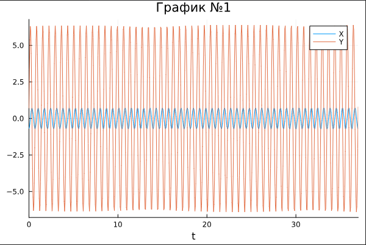
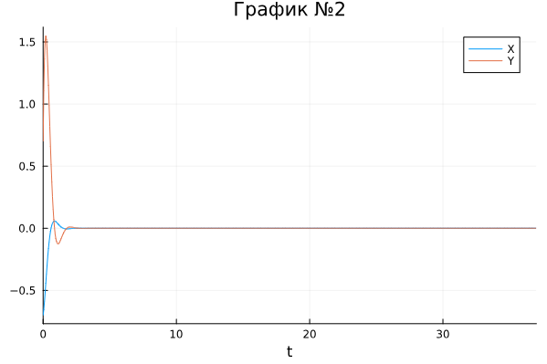
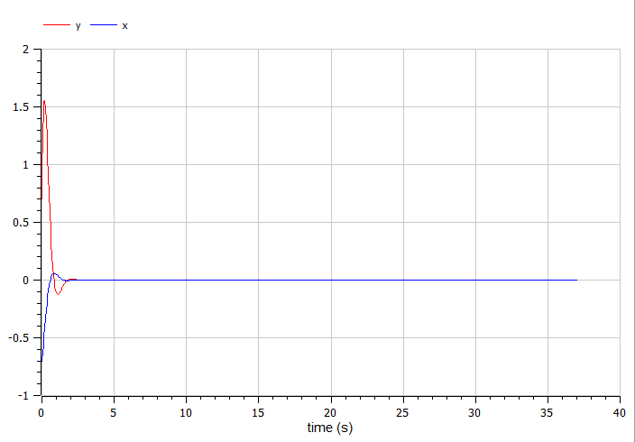
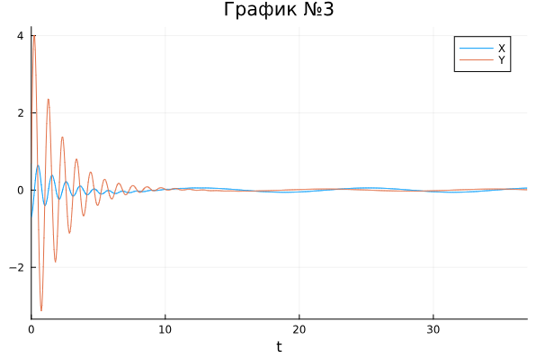
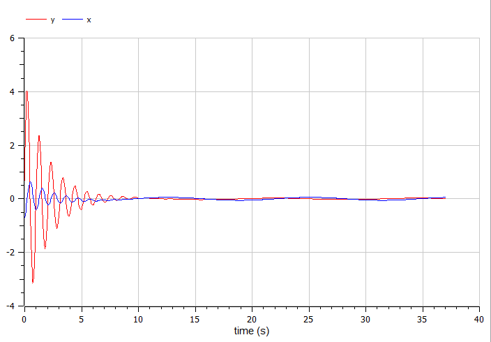

---
## Front matter
title: "Лабораторная работа №4"
subtitle: "Модель гармонических колебаний"
author: "Камкина Арина Леонидовна"

## Generic otions
lang: ru-RU
toc-title: "Содержание"

## Bibliography
bibliography: bib/cite.bib
csl: pandoc/csl/gost-r-7-0-5-2008-numeric.csl

## Pdf output format
toc: true # Table of contents
toc-depth: 2
lof: true # List of figures
lot: false # List of tables
fontsize: 12pt
linestretch: 1.5
papersize: a4
documentclass: scrreprt
## I18n polyglossia
polyglossia-lang:
  name: russian
  options:
	- spelling=modern
	- babelshorthands=true
polyglossia-otherlangs:
  name: english
## I18n babel
babel-lang: russian
babel-otherlangs: english
## Fonts
mainfont: PT Serif
romanfont: PT Serif
sansfont: PT Sans
monofont: PT Mono
mainfontoptions: Ligatures=TeX
romanfontoptions: Ligatures=TeX
sansfontoptions: Ligatures=TeX,Scale=MatchLowercase
monofontoptions: Scale=MatchLowercase,Scale=0.9
## Biblatex
biblatex: true
biblio-style: "gost-numeric"
biblatexoptions:
  - parentracker=true
  - backend=biber
  - hyperref=auto
  - language=auto
  - autolang=other*
  - citestyle=gost-numeric
## Pandoc-crossref LaTeX customization
figureTitle: "Рис."
tableTitle: "Таблица"
listingTitle: "Листинг"
lofTitle: "Список иллюстраций"
lotTitle: "Список таблиц"
lolTitle: "Листинги"
## Misc options
indent: true
header-includes:
  - \usepackage{indentfirst}
  - \usepackage{float} # keep figures where there are in the text
  - \floatplacement{figure}{H} # keep figures where there are in the text
---

# Цель работы

---
## Front matter
title: "Лабораторная работа №4"
subtitle: "Модель гармонических"
author: "Камкина Арина Леонидовна"

## Generic otions
lang: ru-RU
toc-title: "Содержание"

## Bibliography
bibliography: bib/cite.bib
csl: pandoc/csl/gost-r-7-0-5-2008-numeric.csl

## Pdf output format
toc: true # Table of contents
toc-depth: 2
lof: true # List of figures
lot: false # List of tables
fontsize: 12pt
linestretch: 1.5
papersize: a4
documentclass: scrreprt
## I18n polyglossia
polyglossia-lang:
  name: russian
  options:
	- spelling=modern
	- babelshorthands=true
polyglossia-otherlangs:
  name: english
## I18n babel
babel-lang: russian
babel-otherlangs: english
## Fonts
mainfont: PT Serif
romanfont: PT Serif
sansfont: PT Sans
monofont: PT Mono
mainfontoptions: Ligatures=TeX
romanfontoptions: Ligatures=TeX
sansfontoptions: Ligatures=TeX,Scale=MatchLowercase
monofontoptions: Scale=MatchLowercase,Scale=0.9
## Biblatex
biblatex: true
biblio-style: "gost-numeric"
biblatexoptions:
  - parentracker=true
  - backend=biber
  - hyperref=auto
  - language=auto
  - autolang=other*
  - citestyle=gost-numeric
## Pandoc-crossref LaTeX customization
figureTitle: "Рис."
tableTitle: "Таблица"
listingTitle: "Листинг"
lofTitle: "Список иллюстраций"
lotTitle: "Список таблиц"
lolTitle: "Листинги"
## Misc options
indent: true
header-includes:
  - \usepackage{indentfirst}
  - \usepackage{float} # keep figures where there are in the text
  - \floatplacement{figure}{H} # keep figures where there are in the text
---

# Цель работы

Исследовать математическую модель гармонического осциллятора и построить графики, используя языки Julia и OpenModelica.
---
# Задание

Постройте фазовый портрет гармонического осциллятора и решение уравнения гармонического осциллятора для следующих случаев

1. Колебания гармонического осциллятора без затуханий и без действий внешней силы $\ddot x + 9x = 0$
2. Колебания гармонического осциллятора c затуханием и без действий внешней силы $\ddot x + 5.5\dot x + 4.4x = 0$
3. Колебания гармонического осциллятора c затуханием и под действием внешней силы $\ddot x + \dot x + 6x = 2*cos(0.5t)$

На интервале $t \in [0; 37]$ (шаг 0.5) с начальными условиями $X = -0.7, \, Y=0.7$ 
---
# Теоретическое введение

Гармони́ческие колеба́ния — колебания, при которых физическая величина изменяется с течением времени по гармоническому (синусоидальному, косинусоидальному) закону.
Движение грузика на пружинке, маятника, заряда в электрическом контуре, а
также эволюция во времени многих систем в физике, химии, биологии и других
науках при определенных предположениях можно описать одним и тем же
дифференциальным уравнением, которое в теории колебаний выступает в качестве
основной модели. Эта модель называется линейным гармоническим осциллятором.
Уравнение свободных колебаний гармонического осциллятора имеет
следующий вид:
$$
\ddot x + 2\gamma\dot x + \omega _0^2x = 0
$$
где $x$ – переменная, описывающая состояние системы (смещение грузика, заряд
конденсатора и т.д.), $\gamma$ – параметр, характеризующий потери энергии (трение в
механической системе, сопротивление в контуре), $\omega$ – собственная частота колебаний, $t$ – время.
---

# Выполнение лабораторной работы

## Колебания гармонического осциллятора без затуханий и без действий внешней силы

### Создание проекта (код на Julia)
```
using Plots
using DifferentialEquations
X = -0.7
Y = 0.7
R1 = [0, 9]
tspan = (0, 37)

#без действия внешний силы
function f_1(dx, x, p, t)
	g, w = p
	dx[1] = x[2]
	dx[2] = -w^2*x[1] - g*x[2]
end

prob1 = ODEProblem(f_1, [X, Y], tspan, R1)
sol1 = solve(prob1, Tsit5(), saveat = 0.05)
plot(sol1, title = "График №1", label = ["X" "Y"])
```
Полученный график(рис. @fig:001).

{#fig:001 width=70%}
---

### Создание проекта (код на OpenModelica)
```
model lab_04
Real x(start=-0.7);
Real y(start=0.7);
parameter Real w=9;
parameter Real g=0;
equation
  der(x)=y;
  der(y)=-w^2*x-g*y;
end lab_04;
```
Полученный график(рис. @fig:002).

{#fig:002 width=70%}
---

## Колебания гармонического осциллятора c затуханием и без действий внешней силы

### Создание проекта (код на Julia)
```
using Plots
using DifferentialEquations
X = -0.7
Y = 0.7
R2 = [5.5, 4.4]
tspan = (0, 37)

#без действия внешний силы
function f_1(dx, x, p, t)
	g, w = p
	dx[1] = x[2]
	dx[2] = -w^2*x[1] - g*x[2]
end

prob2 = ODEProblem(f_1, [X, Y], tspan, R2)
sol2 = solve(prob2, Tsit5(), saveat = 0.05)
plot(sol2, title = "График №2", label = ["X" "Y"])

```
Полученный график(рис. @fig:003).

{#fig:003 width=70%}
---

### Создание проекта (код на OpenModelica)
```
model lab_04_2
Real x(start=-0.7);
Real y(start=0.7);
parameter Real w=4.4;
parameter Real g=5.5;
equation
  der(x)=y;
  der(y)=-w^2*x-g*y;
end lab_04_2;

```
Полученный график(рис. @fig:004).

{#fig:004 width=70%}
---

## Колебания гармонического осциллятора c затуханием и под действием внешней силы

### Создание проекта (код на Julia)
```
using Plots
using DifferentialEquations
X = -0.7
Y = 0.7
R3 = [1, 6]
tspan = (0, 37)

#внешняя сила
f(t) = 2*cos(0.5*t)

#с действием в нешней силы
function f_3(dx, x, p, t)
	g, w = p
	dx[1] = x[2]
	dx[2] = -w^2*x[1] - g*x[2] + f(t)
end

prob3 = ODEProblem(f_3, [X, Y], tspan, R3)
sol3 = solve(prob3, Tsit5(), saveat = 0.05)
plot(sol3, title = "График №3", label = ["X" "Y"])

```
Полученный график(рис. @fig:005).

{#fig:003 width=70%}
---

### Создание проекта (код на OpenModelica)
```
model lab_04_03
Real x(start=-0.7);
Real y(start=0.7);
Real f;
parameter Real w=6;
parameter Real g=1;
equation
  der(x)=y;
  der(y)=-w^2*x-g*y+f;
  f=2*cos(0.5*time);
end lab_04_03;

```
Полученный график(рис. @fig:006).

{#fig:004 width=70%}
---
# Анализ результатов

Были построены четыре графика на Julia и OpenModelica, на которых видно, что графики абслютно одинаковые.
---

# Вывод

В процессе выполнения данной лабораторной работы я построила графики, используя Julia и OpenModelica, а также приобрела первые практические навыки работы с Julia и OpenModelica.
---

# Список литературы

[1] Гармонические колебания: https://ru.wikipedia.org/wiki/Гармонические_колебания

